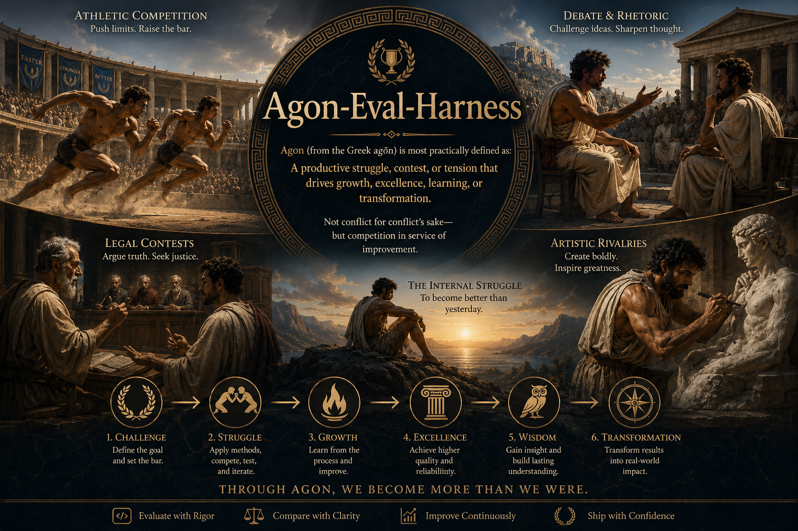

# Agon-Eval-Harness

> **Test Limits. Collide Ideas. Earn Excellence.**

<p align="center">
  
</p>

<p align="center">
  <em>An evaluation harness for modern AI systems — built on the principle that excellence emerges <strong>because of</strong> opposition, not despite it.</em>
</p>

---

> **Status: Phase 1 MVP built.** The core harness runs today on [Inspect AI](https://inspect.aisi.org.uk/): a typed YAML case format, 11 scorers (deterministic + LLM-as-judge), composite/flake scoring, failure taxonomy, regression detection, judge calibration, and Markdown/JSON/JUnit reporting behind an `agon` CLI — all runnable **fully offline** (see Quickstart). Phases 2–3 (LangGraph agents, OpenTelemetry, retrieval recall@k/MRR, OWASP adversarial suite) remain planned. See [`docs/decisions/ADR-0001`](docs/decisions/ADR-0001-inspect-vs-custom.md) for the build decision.

---

## Why "Agon"?

The ancient Greeks used **agon** (ἀγών) to name a contest undertaken in pursuit of excellence. Athletes entered the arena. Philosophers debated. Playwrights competed for honor. Citizens argued cases in court. Each struggled against a worthy opposition — and was made better by it.

Agon was never conflict for its own sake. It was **purposeful opposition in service of improvement**.

Modern AI systems need the same thing. A model, prompt, agent, or workflow shouldn't be trusted because it succeeded once in a demo. It should be trusted because it has *repeatedly survived rigorous challenge*. This harness exists to build that arena.

---

## The Problem This Solves

The industry is excellent at demonstrations and weak at evaluation. A demo answers *"Can it work?"* An evaluation answers the harder questions:

- Does it reliably work?
- Under what conditions does it fail?
- How often, and how badly?
- Is it improving or regressing over time?

`Agon-Eval-Harness` brings a **Test & Evaluation discipline** to AI systems: documented failure modes, honest pass/fail reporting, regression tracking, and reproducible results over headline claims.

---

## What Gets Evaluated

The harness is being built to assess, in rough order of increasing difficulty:

| Target | Examples |
| --- | --- |
| **Models** | Foundation models, fine-tunes, hosted APIs, local models |
| **Prompts** | System prompts, prompt variants, context-engineering strategies |
| **Retrieval** | RAG pipelines, chunking/embedding choices, hybrid search, reranking |
| **Agents** | Tool-using agents, ReAct loops, multi-turn behavior, planning, memory/state |
| **End-to-end systems** | Full agentic workflows, production deployments |

---

## Evaluation Categories

What the harness measures, and the question each category answers:

- **Functional Correctness** — Did it produce the right result?
- **Tool Use** — Did it select and call the right tools, correctly?
- **Planning** — Did it form and execute a reasonable plan?
- **State Management** — Did it hold accurate context and memory across turns?
- **Robustness** — How does it hold up under stress, ambiguity, and adversarial input?
- **Reliability** — Can it repeat a success consistently, not just once?
- **Safety** — Does it avoid unacceptable behaviors and failure modes?

---

## Core Philosophy

**Excellence emerges through opposition.** A system is proven by surviving challenge, not by succeeding under ideal conditions. Every benchmark, adversarial case, regression test, and production failure is a modern agon.

**Failure is data.** Failure isn't the enemy — *undiscovered* failure is. Every failure should become a lesson, a test case, a regression check, and a future improvement.

**Production is reality.** Offline evaluations matter; production behavior matters more. Production traces continuously generate new evaluation cases, so the harness grows stronger over time:

```text
Design → Evaluate → Deploy → Observe → Learn → Improve ─┐
   ▲                                                     │
   └─────────────────────────────────────────────────────┘
```

**Trust requires evidence.** Every claim is backed by metrics, traces, evaluations, and reproducible results — never by assertion.

---

## Architecture (Planned)

```text
                        AGON
                          │
                          ▼
        ┌──────────────────────────────────┐
        │            Eval Suite             │
        │  Benchmarks · Adversarial Cases   │
        │  Regression Tests · Prod Failures │
        └────────────────┬──────────────────┘
                         ▼
        ┌──────────────────────────────────┐
        │           Agent Harness           │
        │  Model · Prompt · Tools           │
        │  Memory · State · Planning        │
        └────────────────┬──────────────────┘
                         ▼
        ┌──────────────────────────────────┐
        │         Evaluation Layer          │
        │  Metrics · Scorers · Judges       │
        │  Human Review                     │
        └────────────────┬──────────────────┘
                         ▼
        ┌──────────────────────────────────┐
        │             Results               │
        │  Scores · Traces · Reports        │
        │  Regression Tracking              │
        └────────────────┬──────────────────┘
                         ▼
        ┌──────────────────────────────────┐
        │      Continuous Improvement       │
        │  Failure Discovery · New Tests    │
        │  Eval Suite Growth                │
        └──────────────────────────────────┘
```

---

## Repository Structure (Target)

```text
Agon-Eval-Harness/
├── README.md
├── docs/
│   ├── images/            # Header and diagrams (drop agon-header.png here)
│   ├── philosophy/
│   ├── architecture/
│   ├── patterns/
│   ├── examples/
│   └── decisions/         # Architecture Decision Records (ADRs)
├── evals/
│   ├── benchmark/
│   ├── adversarial/       # Red-team suite (OWASP Top 10 for Agentic Apps)
│   ├── regression/
│   └── production/        # Cases harvested from production traces
├── harness/
│   ├── agents/
│   ├── workflows/
│   ├── tools/
│   └── memory/
├── judges/
│   ├── rule_based/
│   ├── llm_judge/
│   └── hybrid/
├── traces/                # OpenTelemetry GenAI trace schemas + examples
│   ├── schemas/
│   └── examples/
├── reports/
└── experiments/
```

---

## Tech Stack

The harness targets the canonical production eval stack — the same tooling used at frontier labs and the scale-ups already hiring for this discipline:

| Layer | Tooling |
| --- | --- |
| **Eval framework** | [Inspect AI](https://inspect.ai-safety-institute.org.uk/) (UK AISI) |
| **Agent orchestration** | LangGraph / LangChain |
| **Observability** | OpenTelemetry GenAI Semantic Conventions → LangSmith / Grafana + Tempo |
| **Retrieval** | pgvector / LanceDB, hybrid search, reranking |
| **Production runtime** | FastAPI · Pydantic · asyncio |
| **Quality + tooling** | pytest · uv · ruff |
| **Packaging + CI** | Docker · GitHub Actions |
| **Cloud** | AWS (S3, IAM, ECR, App Runner, Secrets Manager, Bedrock) |

---

## Roadmap

The build is sequenced in three phases. Each ends with a public, independently reproducible milestone — a reviewer should be able to clone and run the harness in under 20 minutes.

### Phase 1 — Foundation
- [x] Evaluation case format (typed YAML) and local execution loop (Inspect `eval`)
- [x] First Inspect AI eval suite (20-case offline smoke suite)
- [x] Rule-based + LLM-as-judge graders, with the judge validated against held-out labels (`agon calibrate`)
- [x] CI gate that breaks the build on regression (`agon run`/`compare` exit codes + GitHub Actions)
- [x] Documented error taxonomy mapping failure modes to the evals that catch them (`detected_failure_labels`)

### Phase 2 — Observability & Real Agentic Systems
- [x] **OpenTelemetry GenAI export** — eval runs → `gen_ai.*` span tree (model/tool/grader); console (offline), LangSmith (OTLP), or Grafana Tempo backends (`agon trace`, ADR-0003)
- [x] **Retrieval evals isolated from generation** — recall@k / MRR / nDCG / hit@k, BM25 + LanceDB + RRF hybrid (M1; full RAG-pipeline integration pending)
- [x] **Agent evaluation** — `tool_use` / `planning` / `step_efficiency` scorers over a tool-call trajectory; native Inspect ReAct agent SUT (offline). LangGraph bridge shipped **experimental** (see ADR-0004 for current inspect/langchain incompatibilities)
- [ ] LangSmith integration: dataset versioning, run comparison, evaluator dashboards

### Phase 3 — Red Team, Domain & Thesis
- [x] **Adversarial suite (first cut)** — OWASP-for-Agents failure modes (prompt injection, goal hijacking, memory poisoning, tool misuse) detected fully offline via scripted vulnerable/resistant agents (M4, ADR-0005); full Top-10 + real-provider red-team pending
- [x] **Real-provider hardening** — resilience knobs (retries/timeouts/sample-retry/time-limit/error-rate threshold) exposed via config + CLI, plus offline-provable **cost & token observability** in reports (M5, ADR-0006); secrets-manager + live red-team pending
- [x] **Statistical rigor** — Wilson confidence intervals on pass rates, a two-proportion significance test + small-sample awareness in regression, and a Cohen's kappa CI in judge calibration; closed-form, no new dependency (M6, ADR-0007)
- [x] **Regulated-domain eval harness** — worked gait-sensor escalation-triage suite (synthetic data); asymmetric-ordinal scorer where a CRITICAL under-escalation forces a release FAIL (M11, ADR-0012). See `examples/gait_triage/`
- [x] **Published methodology essay** — *What We Measure When We Measure an Agentic System*: evaluation as an adversarial discipline, with every claim cashed out against the harness ([docs/methodology/measuring-agentic-systems.md](docs/methodology/measuring-agentic-systems.md))
- [ ] Open-source contribution to `inspect_evals` or equivalent

---

## What We Favor / What We Reject

| ✅ We favor | ❌ We reject |
| --- | --- |
| Evidence over claims | Benchmark theater |
| Reproducibility over anecdotes | Leaderboard chasing |
| Traceability over mystery | Opaque scoring |
| Understanding over score-chasing | Single-number obsession |
| Learning over rankings | Demo-driven confidence |

---

## Who This Is For

AI engineers, evaluation engineers, test engineers, prompt engineers, agent developers, researchers, and system architects — anyone who believes a system should prove itself before it's trusted.

---

## Getting Started

**Requirements:** Python 3.11–3.12 and [uv](https://docs.astral.sh/uv/). No API key needed for the offline path.

```bash
uv sync                       # create the env and install deps (Python pinned to 3.12)
uv run pytest                 # self-test the harness
```

### Quickstart (fully offline — no API key, no model downloads)

```bash
# 1. Run the 20-case smoke suite against the offline mock SUT, with a deterministic CI gate.
uv run agon run examples/datasets/rag_smoke.yaml --display none
#    → writes reports/<run_id>.report.{md,json,junit.xml}; exit 0 (PASS) / 1 (FAIL) / 2 (abort)

# 2. See a realistic mixed report (PASS/FAIL/INVESTIGATE) against an in-process stub SUT.
uv run python examples/quickstart.py

# 3. Inspect per-sample traces in Inspect's viewer.
uv run inspect view --log-dir logs

# 4. Compare two runs for regressions (CI gate breaks on regression).
uv run agon compare <current_run_id> <baseline_run_id>

# 5. Validate an LLM judge against human labels before trusting it (needs a real judge model).
uv run agon calibrate examples/calibration/labeled.yaml --judge-model openai/gpt-4o --min-kappa 0.6

# 6. Evaluate a tool-using ReAct agent offline (tool_use / planning / step_efficiency).
uv run python examples/agent_quickstart.py
#    → catches a wrong-tool case as a tool_omission failure

# 7. Isolated retrieval eval (recall@k / MRR / nDCG / hit@k) — offline BM25, no generation.
uv sync --extra retrieval
uv run agon retrieve examples/retrieval/corpus.yaml examples/retrieval/qrels.yaml --k 5
#    → retrieval-only report, scored independently of any generation

# 8. Export a run as OpenTelemetry GenAI spans — offline to console (no account needed).
uv sync --extra otel
uv run agon trace <run_id> --backend console
#    → or --backend langsmith / --backend otlp (Grafana Tempo). See docs/observability.md
#    → See docs/langsmith-dashboards.md for building LangSmith dashboards from enriched eval traces.

# 9. Run the offline OWASP adversarial suite (4 attacks caught, 4 controls pass).
uv run python examples/adversarial_quickstart.py
#    -> scripted vulnerable/resistant agent; OWASP scorecard via per-category reporting

# 10. Run a brand-new-domain eval (text-to-SQL) with a custom scorer loaded via --plugin.
uv run python examples/text_to_sql/run.py        # offline: 4/6 pass (equivalent SQL passes, wrong/malformed fail)
uv run agon run --plugin examples/text_to_sql/sql_scorer.py examples/text_to_sql/dataset.yaml --display none
#    -> custom `sql_result_match` scorer compares result rows, not SQL strings

# 11. Resume a prior run — re-runs only failed/incomplete cases and merges into a fresh report.
uv run agon resume <run_id> --display none
#    -> or: agon resume --latest   (picks the most recent run automatically)
#    -> exits 0 with "nothing to resume" if all cases in the prior run completed
```

To evaluate a **real** system, point the SUT and judge at a provider via a run config
(`examples/run.toml`): set `[sut] adapter = "litellm"`, `model = "openai/gpt-4o"`, and a real
`[judge] model`. The `http` adapter posts cases to an external RAG/agent service.

### What's built (the `agon/` package)

| Module | Responsibility |
|---|---|
| `schemas/` | Typed case / config / result models (Pydantic v2) |
| `dataset/` | YAML→`Sample` loader, content-addressed `dataset_version` |
| `sut/` | SUT adapters: `mockllm` (offline), `callable`, `http` |
| `scoring/` | 11 scorers (exact/keyword/citation/rubric/safety/RAG…) + composite + flake reducers |
| `analysis/` | Eval-log digests + regression comparator; errors broken down by category (`timeout` / `resource` / `network` / `scorer` / `sample`) via `error_count_by_category`; dataset cases may set `sample_time_limit` for a per-case timeout independent of the run-level default |
| `reporting/` | Markdown / JSON / JUnit-XML + PASS/FAIL/INVESTIGATE recommendation |
| `calibrate/` | Judge-vs-human agreement (Cohen's κ) |
| `retrieval/` | Isolated retrieval evals — BM25 + LanceDB + RRF hybrid, recall@k/MRR/nDCG/hit@k (Phase 2 M1) |
| `sut/` (agent) | Native ReAct agent SUT + message→trajectory normalization; experimental LangGraph bridge (Phase 2 M2) |
| `scoring/` (agent) | `tool_use` / `planning` / `step_efficiency` trajectory scorers (Phase 2 M2) |
| `observability/` | Export eval runs as OpenTelemetry GenAI spans → console / LangSmith / Tempo (Phase 2 M3) |
| `cli/` | `agon run · resume · compare · report · review · calibrate · retrieve · trace` |

> Note: the **Repository Structure (Target)** above is the long-term Phase 2/3 layout. The
> shipped MVP lives under `agon/` with `examples/` and `tests/`.

---

## Contributing

Contributions, adversarial test cases, and documented failure modes are all welcome — a good failure report is as valuable here as a working feature. See **[CONTRIBUTING.md](CONTRIBUTING.md)** for dev setup and conventions, and **[docs/extending.md](docs/extending.md)** for how to add your own dataset, scorer, or SUT adapter. Start from the copy-me skeleton in [`templates/your-eval/`](templates/your-eval/).

---

## License

License TBD — to be selected before the Phase 1 public release.

---

> *"Excellence is not the absence of opposition, but victory through it."*
>
> **Through agon, we become more than we were.**
