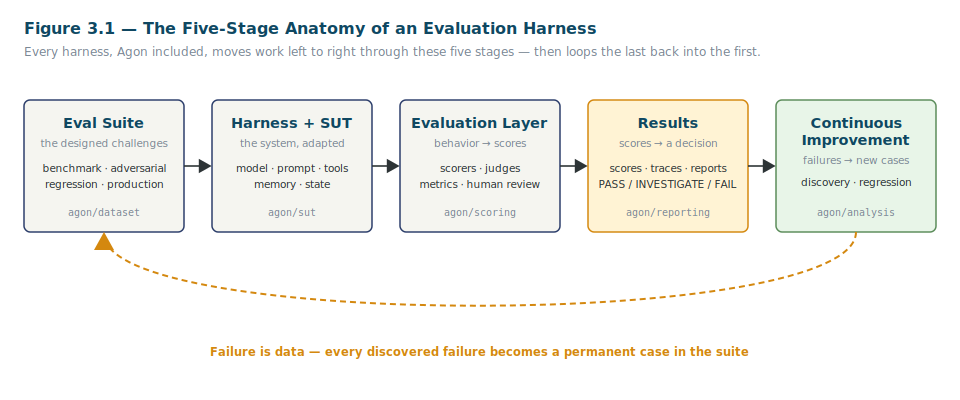
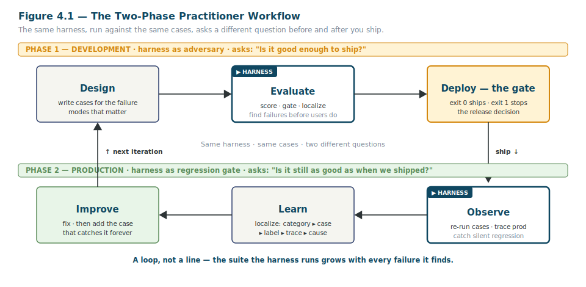

<!--
  STYLING NOTE (for the eventual .docx build — not part of the body text):
  General style guide (Steel Blue / Charcoal / Amber, Segoe UI 11pt body) governs everything here,
  with ONE deliberate override: the full heading hierarchy (H1–H4) is rendered in Teal-Blue #0F4761.
  No AVSH branding, no AVSH running header/footer — this is a Learning artifact about Agon.
  Markdown cannot carry heading color; apply #0F4761 to all heading styles when this is typeset.
  Figures are SVG vector art in ./figures/ and are referenced inline at their call-outs.
-->

# The Agon Eval Harness
## A Practitioner's Manual

| | |
|---|---|
| **Document code** | AGON-TM-001 |
| **Part** | I — The Discipline (Chapters 1–4 + Note to the T&E Reader) |
| **Version** | 0.1 — *draft for tone & depth review* |
| **Date** | 2026-06-08 |
| **Author** | Samuel R. Taylor |
| **Status** | Part I draft only. Subsequent parts follow your sign-off on this one. |

---

### About this draft

This is **Part I only**, delivered first so you can judge three things before any more of the manual is written:

1. **Teaching voice** — is the level right for a reader with strong systems instincts and no computer-science background? Does it explain without talking down?
2. **Depth calibration** — when the manual *teaches* a concept (rather than citing that the code implements it), is the depth what you want — too much, too little, about right?
3. **The interpretation-first promise** — every place a result appears, does the text tell you what the result is *telling you to do*, not just what it says?

Nothing past Part I has been drafted. The two required Part I figures are included as vector art. Read this as a representative sample of the whole, not as a finished front section.

---

## How to use this manual

This manual has one reader in mind and teaches accordingly. A few conventions will make the rest of it easier to follow.

**Two registers, in order, inside every chapter.** Each chapter first explains *why* a thing exists — the concept and the reasoning — and then shows you *how* to operate it: the exact command, the file it lives in, the output you should expect. The "why" is there so the "how" is never a ritual you perform without understanding. You should finish each chapter able to both run the thing and explain to someone else why it works the way it does.

**Offline-first.** Almost everything in this manual runs on your laptop with no API key, no cloud account, and no model downloads. That is a deliberate property of the harness, not a limitation of the manual, and Chapter 5 explains why it matters more than it might first appear. When a topic genuinely requires a paid model provider — there are only a few — the text says so plainly and tells you what changes.

**Interpretation-first.** A number is not the end of an evaluation; a *decision* is. Wherever this manual shows you a score, an interval, a recommendation, or an exit code, it also tells you what to do with it. If you ever reach the end of a results section and still don't know what action it implies, that is a defect in the manual — flag it.

**From Agon to the general case.** This is a manual about one specific harness, but its larger purpose is to make you fluent in *eval harnesses as a category*. So most component chapters end by stepping back: here is the portable principle, and here is how a different harness — Inspect AI underneath Agon, or lm-eval-harness, promptfoo, OpenAI Evals — expresses the same idea under a different name. When you later meet an unfamiliar harness, you will recognize its parts.

**Written for a T&E reader, readable by anyone.** The manual's primary reader is a Test & Evaluation professional, and it occasionally pauses to map a concept onto T&E practice — the "Note to the T&E reader" that follows, and shorter asides later. Those asides are optional bridges, not load-bearing content: every concept is also taught from scratch in plain terms, so a reader who has never heard of developmental test or a regression suite loses nothing by skimming past them.

**A note on the source tags.** Many sections open with a short italic note marking whether the material is *recoverable from the repository* (source, configs, ADRs, docstrings) or *supplied from outside it* (teaching scaffolding, selection guidance, the T&E framing). These tags are provenance, in the spirit of the harness's own evidence-over-claims rule: they tell you where each claim comes from and which parts you could verify yourself in the code.

**A note on the two names you'll see.** *Agon* is the harness this manual teaches. *Inspect AI* (or just "Inspect") is the open-source evaluation engine, built by the UK's AI Safety Institute, that Agon is built on top of. Chapter 3 explains exactly where one ends and the other begins and why the boundary was drawn there. For now: when you see "Inspect," think "the engine"; when you see "Agon," think "the harness you operate."

---

## Note to the T&E Reader

*This bridge is written from the Test & Evaluation discipline, not from the codebase. The repository contains no T&E framing; that mapping is supplied here on purpose, because it is the fastest on-ramp for the manual's primary reader. If you don't come from T&E, you can skim or skip this note — every concept in it is taught from scratch in the chapters, and the manual stands on its own without it.*

If you have spent a career in Test & Evaluation, you already own most of the conceptual machinery in this manual. What you do not yet own is the vocabulary the AI field wraps around it, and a handful of places where a stochastic system under test breaks an assumption that deterministic hardware and software let you take for granted. This note maps the new words onto the discipline you already practice, so that the rest of the manual reads as *familiar work in unfamiliar clothes* rather than a new field.

Start with the core analogy. An **evaluation harness** is a **test apparatus**. It is the rig, the fixtures, the instrumentation, and the recorded procedure that subjects a thing to designed conditions and captures what it does — under your control, repeatably, so the results mean something to someone who wasn't in the room. You have built or operated dozens of these. The fact that the thing under test is now an AI system rather than a radar or a vehicle subsystem changes the content of the test, not its nature.

The terms map cleanly:

| T&E concept you already use | Eval-harness term in this manual | What's the same | What's different |
|---|---|---|---|
| System under test; unit under test | **System Under Test (SUT)** | The bounded thing you're measuring, isolated from everything else | The SUT is often non-deterministic — same input, different output run to run |
| Test card / test procedure | **Eval case** (and a **dataset** of them) | A single designed condition with an expected outcome and a pass criterion | Cases are data files, version-controlled, and re-run automatically |
| Verification & Validation (V&V) | **Scoring** (deterministic scorers + judges) | Deciding whether observed behavior meets the requirement | Some criteria are graded by another AI model — which must itself be validated first |
| Developmental Test (DT) | **Phase 1 — evaluation during development** | Find deficiencies early, with the builders, before the system is fielded | The "build" can change underneath you when a model vendor updates a model |
| Operational Test (OT) | **Phase 2 — evaluation in production** | Confirm the fielded system still performs under real conditions | Real conditions arrive as *traces* you can harvest into new test cards |
| Regression suite | **Regression tracking** (`agon compare`) | Re-run prior tests to confirm nothing that worked has broken | Every fielded failure is converted into a permanent new regression case |
| Test-fix-test (TAAF) | **The two-phase loop** (Chapter 4) | Find a fault, fix it, re-test to confirm and to guard against recurrence | The loop is the product; the suite is designed to grow harder over time |
| Acceptance / readiness gate | **The release gate** (exit codes 0/1/2) | A pass/fail decision that authorizes or blocks fielding | The gate is automated and deterministic, so a human cannot quietly wave a failure through |

Three differences are worth flagging up front, because they are where T&E instincts need a small adjustment.

**First: the SUT is stochastic.** A unit that passes its test card once may fail the identical card on the next run, not because anything broke, but because the underlying model samples its outputs probabilistically. This is why Chapter 12 treats a pass rate as a point estimate with error bars, and why the harness reports a confidence interval on every result rather than a bare percentage. You are used to measurement uncertainty in instrumentation; here the uncertainty is in the system under test itself.

**Second: the "build" is not under your configuration control.** When the model behind an AI system is a hosted service, the vendor can change it without telling you, and a system that passed last month can regress this month with no change to your code. This is not a hypothetical — it is the central reason Phase 2 exists. The harness is the standing instrument that tells you whether the fielded system is still the system you accepted.

**Third: one of your instruments — the AI "judge" — is itself a system that must be evaluated.** Some pass/fail decisions are too open-ended for an exact-match rule, so the harness uses another AI model to grade the output. In T&E terms, that is like grading a test with an instrument of unknown calibration. The manual does not let you trust such a judge until it has been calibrated against human-labeled ground truth and cleared a measured agreement threshold (Chapter 9). A judge is an evaluated component, not an oracle.

Hold onto one more T&E reflex as you read, because it is exactly the right one: *a demonstration is not a test.* You already know the difference between a vendor demo run under conditions the vendor chose and an operational test run under conditions you chose. The entire philosophy of this harness — the subject of Chapter 2 — is that distinction, applied relentlessly to AI systems. You are not learning a new value system. You are learning the tooling that lets you apply the one you already have to a new class of system.

---

# PART I — THE DISCIPLINE

*Why harnesses exist, and the theory that transfers to any of them.*

Part I is deliberately light on commands. Before you operate Agon, it is worth understanding what kind of thing it is, why it is named the way it is, what shape every harness shares, and how the same harness does two different jobs across a system's life. Those four ideas — covered in the four chapters that follow — are the load-bearing concepts. Everything in Parts II through VI is the detailed *how* hung on this *why*. If you understand Part I, the rest of the manual is operating instructions. If you skip it, the rest is a sequence of incantations.

---

## Chapter 1 — What an Evaluation Harness Is (and Why It Matters)

Before we touch Agon specifically, we need to be precise about the object of study. The phrase "evaluation harness" gets used loosely in the AI field, often as a synonym for "the thing that produces a benchmark number." That usage hides exactly the parts that matter. So we will build the definition up from the ground, one piece at a time, and by the end of this chapter you will be able to say not only what a harness *is* but what it is *for* — which turns out to be the more important question.

### What "evaluation harness" actually means

*The repository never contrasts these terms; the distinction is supplied here because it is the most common source of confusion for newcomers.*

A useful definition, in one sentence: **an evaluation harness is a repeatable apparatus that subjects an AI system to a set of designed challenges and measures the results as evidence for a decision.**

Every clause in that sentence is doing work.

*Repeatable* means you — or someone who has never met you — can run it again and get a comparable result. A measurement you cannot reproduce is an anecdote. Repeatability is what separates a harness from a one-time experiment.

*Apparatus* means it is a built thing with parts: a place the test cases live, a way to feed them to the system, a way to grade the responses, and a way to report what happened. We will name those parts precisely in Chapter 3. For now, hold onto the idea that a harness is *assembled*, not improvised.

*Designed challenges* means the inputs are chosen, not stumbled into. Someone decided what to test, including the conditions where the system is most likely to fail. The design of the challenges is where the engineering judgment lives.

*Measures the results* means it produces numbers and records, not impressions. "It seemed to do well" is not a measurement. "It passed 17 of 20 cases, with the three failures concentrated in structured-output formatting" is.

And the last clause — *as evidence for a decision* — is the one most definitions leave out, and the one this manual will not let you forget. A harness does not exist to produce a score. It exists to support a decision: ship it or don't, trust it or don't, fix this before that. A score that no one acts on is wasted measurement. We will return to this idea, the *evidence-to-decision* link, throughout the manual, because it is the difference between evaluation as theater and evaluation as engineering.

Now contrast the harness with three things it is frequently confused with. The distinctions are not pedantic; each one is a different tool for a different job, and reaching for the wrong one is a common and expensive mistake.

| Tool | What it answers | What it is for | Why it is not a harness |
|---|---|---|---|
| **Benchmark** | "How does this system score on a standard, shared task?" | Comparing systems against each other on common ground | A benchmark is one *dataset* you might run *through* a harness; it is content, not apparatus |
| **Leaderboard** | "Which system ranks highest right now?" | Public ranking and competition | It optimizes for *relative* position, not for whether *your* system meets *your* bar |
| **Unit test** | "Does this specific function return the exact expected value?" | Catching deterministic code defects | It assumes a single correct answer and a deterministic system — both of which fail for AI outputs |

The leaderboard distinction is the one worth dwelling on, because the AI field is saturated with leaderboards and they quietly shape how people think. A leaderboard answers a *comparative* question: is system A better than system B? That is sometimes what you want. But far more often, the question you actually have is *absolute*: is this system good enough to field, for my use, against my requirements? A system can be ranked first on a public leaderboard and still be unacceptable for your purpose — and a system can rank nowhere on any leaderboard and be exactly what you need. A harness is built to answer the absolute question. It measures your system against your bar, which is a readiness question, not a ranking one. If you are a T&E reader, you already feel the difference in your bones: an acceptance gate is not a sports ranking.

The unit-test distinction matters for a different reason. If you come from software, the reflex is to think "I'll just write tests." But a unit test assumes two things that AI systems violate. It assumes there is exactly one correct output (AI outputs are often open-ended — many phrasings are equally correct), and it assumes the system is deterministic (AI outputs vary run to run). A harness is, in part, the machinery you need *because* unit testing's assumptions don't hold. It tolerates many-correct-answers through smarter scoring, and it tolerates run-to-run variation through statistics. Chapters 8 through 12 are largely about exactly these two accommodations.

### The System Under Test, and why testing borrows the term

*The code uses `SUTRequest` and `SUTResponse` throughout but never defines the term for a newcomer; the definition is supplied here.*

Throughout this manual you will see the abbreviation **SUT** — System Under Test. It is worth a moment because the term carries an idea, not just a label.

The thing you are evaluating is *bounded*. You draw a box around it and declare: everything inside the box is what I'm testing; everything outside is the test rig. The boundary is a choice, and choosing it well is half of designing a good evaluation. If your box is too big — say, you wrap the model, the prompt, the retrieval system, the tools, and the network all into one SUT — then when something fails, you cannot tell *which part* failed. If your box is too small, you may be testing a component in isolation that behaves differently once it's connected to everything else.

The discipline of naming the SUT is the discipline of saying, precisely, *what am I holding responsible for this result?* In Agon, that boundary is made concrete by a small, fixed contract: whatever your SUT is — a hosted model, a prompt, a full agent, an external service — Agon talks to it through one normalized request-and-response shape (`SUTRequest` in, `SUTResponse` out). That contract is the wall of the box. Everything on the far side is the system under test; everything on the near side is harness. Chapter 7 makes this hands-on. The reason the field borrowed "System Under Test" from hardware and software T&E is that the idea — isolate the responsible thing, instrument its boundary, measure what crosses it — transferred perfectly. The content changed; the discipline did not.

### Why the AI industry is strong at demos and weak at evaluation

*The README alludes to this; the industry history and the concrete costs are not in the repository, and are supplied here.*

There is a structural reason the field is in this state, and understanding it tells you why a harness is worth the effort.

A **demonstration** answers one question — *can this system do the thing?* — under the most favorable conditions available: curated inputs, a forgiving audience, a single run that, if it had gone badly, simply would not have been shown. A demo is a performance, and there is nothing dishonest about a good performance. The problem is that demos are cheap to produce and emotionally convincing, which is a dangerous combination: a system that demos beautifully feels finished, and that feeling is the trap.

An **evaluation** answers the harder questions a demo cannot: Does it work *reliably*, across the spread of real inputs it will actually meet, not just the ones someone picked? Under what conditions does it fail, and how badly? How often? Is it getting better or quietly getting worse as the model underneath it changes? None of those questions can be answered by watching a system succeed once. They can only be answered by watching it fail — deliberately, repeatedly, under conditions designed to find the failures that matter most.

The costs of skipping that work are not abstract. A system trusted on the strength of a demo fails in the field, where the failure is more expensive to diagnose, more public, and — in regulated or safety-relevant settings — potentially harmful before anyone notices. Worse, a demo-validated system can regress silently: the vendor updates the model, the behavior shifts, and nothing tells you, because you never built the instrument that would. The gap between "it demoed well" and "it has been evaluated" is the gap between confidence and evidence. This manual is about closing it.

> *A note on a number you might expect here.* Industry-context discussions of this problem sometimes cite course-enrollment figures as evidence of how hungry the field is for evaluation skills. One such figure appears inconsistently across the available sources, so it is deliberately omitted rather than guessed at. This is the manual's own evidence-over-claims rule applied to itself: a number whose provenance cannot be established is flagged, not repeated. *[TK: enrollment figure pending reconciliation.]*

### Evidence becomes a decision — the first interpretation beat

*This is the Principle-2 content the plan asks Part I to begin establishing; it is not in the repository.*

Here is the habit this manual is trying to build in you, introduced now and reinforced in every chapter that produces a result.

A result exists to be *acted on*. When a run finishes and hands you a number, the number is not the deliverable. The deliverable is the next action it implies. So the reflex to build is: every time you see a result, ask *what is this telling me to do?*

The simplest output Agon produces is the exit code. When you run an evaluation, the harness ends by returning one of three codes to whatever launched it:

- **`0` — PASS.** The system met the bar. The decision: proceed.
- **`1` — FAIL.** The system did not meet the bar. The decision: stop, and localize the failure before doing anything else.
- **`2` — abort.** The run itself didn't complete cleanly — something in the test rig broke, not necessarily the system. The decision: fix the rig and re-run; do not draw a conclusion about the SUT yet.

One refinement to expect, developed fully in Chapter 11: the harness's *recommendation* is three-valued — PASS, INVESTIGATE, FAIL — but the exit-code *gate* is binary. An INVESTIGATE exits `1` alongside FAIL, because the gate fails closed: "a human needs to look" does not pass a release automatically. So the three codes above are the *gate* (what a release decision acts on), and FAIL here stands for "anything short of a clean pass."

Each code maps to an action, not just a status. Later chapters add far richer outputs — confidence intervals, per-category breakdowns, a PASS/INVESTIGATE/FAIL recommendation, failure labels, traces — but every one is taught the same way: here is the field, and here is what it is telling you to do. The one question to carry out of Part I is *what is this result telling me to do?*

### When to reach for a harness — and when not to

*No scoping or decision guidance exists in the repository; this is supplied because choosing the wrong tool is a common and costly error.*

A harness is not free. It is apparatus you have to build and maintain, and like any apparatus it is overkill for some jobs. Part of operating one well is knowing when *not* to. Here is a rough decision guide.

| Your situation | Reach for | Why |
|---|---|---|
| One-off curiosity: "does this prompt roughly work?" | A **spot-check** (just try it a few times) | No decision rides on it yet; building apparatus is premature |
| "Is variant A better than variant B for this one metric, right now?" | A focused **A/B comparison** | You need a relative answer once, not a repeatable absolute one |
| "Does this deterministic function return the exact right value?" | A **unit test** | The output is single-valued and reproducible; classic testing fits |
| "Is this system good enough to field, and will I know if it regresses?" | A **harness** | You need a repeatable, absolute, decision-bearing measurement over time |
| "Where, specifically, does this system fail, and how do I keep it fixed?" | A **harness** | Failure localization and regression tracking are exactly what it's for |

The pattern: reach for a harness when the question is *absolute* (good enough for my bar?), *recurring* (I'll need to ask again as things change), and *decision-bearing* (something happens based on the answer). When all three are true, the cost of the apparatus pays for itself. When they aren't — when you just want a quick look — a harness is heavier than the moment calls for, and pretending otherwise is its own kind of theater.

### The four guiding commitments, as engineering and not slogans

*These are stated in the project's README and CLAUDE.md and enforced in code; the job here is to teach why each is an engineering decision, not to transcribe the list.*

Agon is built on four commitments. They read like values, and they are, but each one cashes out as a concrete engineering choice you will see enforced in the code later. Meeting them now, at the level of principle, will make those later choices feel inevitable rather than arbitrary.

**Failure is data, not noise.** The instinct, when a test catches a failure, is to fix the failure and move on. The commitment says: do not move on until the failure has become a *permanent* test case. A failure you fix and forget will recur the next time conditions allow, and the second occurrence will slip through silently because nothing is watching for it. So every discovered failure is converted into a regression case that re-runs forever. Engineering consequence: the suite grows over time, and it grows *specifically harder in the places your system has actually failed.* This is the single most important habit the harness encodes, and Chapter 4 shows the loop that makes it automatic.

**Evidence over claims.** Nothing in a result is reported by assertion. A pass rate comes with a confidence interval. A cost figure comes from metered tokens, not an estimate someone typed. A "this judge is reliable" statement comes with a measured agreement score, not a vibe. Engineering consequence: wherever the harness could either *measure* a thing or *claim* it, it measures it — even when measuring is less convenient, and even in offline mode where it would be easy to fake. You saw this rule turned on the manual itself a few pages ago, with the omitted enrollment figure.

**Reproducibility is a hard requirement.** The stated bar is concrete and unusually demanding: a reviewer who has never seen this project can clone it and reproduce the example runs in under twenty minutes, on their own machine, with no API key and no model downloads. That is not a convenience; it is what makes the results *independently verifiable*, which is what makes them trustworthy. Engineering consequence: the default path uses a deterministic mock model, so the whole thing runs offline and identically everywhere. Chapter 5 makes this real, and explains why "offline-first" is a precondition for trust rather than a fallback for when you're on a plane.

**Separate concerns the system blurs.** The headline example, which the harness enforces in code: a retrieval-augmented system has *two* distinct ways to fail — the retriever fetched the wrong information, or the model wrote a bad answer despite having the right information. These demand different diagnoses and different fixes. If you fold them into one score, you cannot tell which failure you have. So the harness measures retrieval quality on its own axes (Chapter 14) and refuses to average it into answer quality. Engineering consequence: certain scores are deliberately kept out of the combined number, by code, so a strong retriever cannot paper over a weak generator or vice versa.

**No single-number obsession.** Related but distinct: even within one system, the harness tracks seven evaluation categories — Functional Correctness, Tool Use, Planning, State Management, Robustness, Reliability, Safety — *separately*, and resists collapsing them into one headline. The reason is that an aggregate is a hiding place. A reassuring 85% can conceal a safety category sitting at 50%, because the easy categories do most of the arithmetic. Engineering consequence: reports break results down by category and by risk level, and the safety dimension is wired so it cannot be averaged away. Chapter 10 builds this out.

These four — really five, since the last two are siblings — each recur later as a specific line of code doing a specific job. Naming them here is what lets you recognize them, when you meet them, as commitments kept rather than features encountered.

---

## Chapter 2 — Why "Agon": The Philosophy of Adversarial Measurement

A name is usually just a label. This one isn't: the harness is called Agon on purpose, and the purpose is an argument about how measurement should work. Take that argument seriously and the rest of the harness stops looking like a pile of features and starts looking like a single idea, consistently applied — which is why understanding the name is the fastest way to understand the method.

### The Greek *agon* — opposition in service of improvement

*The README's "Why 'Agon'?" section states this; here it is taught from first principles for a reader new to the framing.*

The ancient Greeks used the word **agon** (ἀγών) to name a contest undertaken in pursuit of excellence. Athletes entered the arena. Philosophers debated to sharpen an argument. Playwrights competed for honor at the festivals. Citizens argued cases before a court. In each, someone struggled against a worthy opponent — and was made better by the struggle.

The crucial point, and the one that makes the word the right name for an evaluation harness, is that *agon was never conflict for its own sake.* It was not about destroying the opponent. It was **purposeful opposition in service of improvement** — a structured contest designed to draw out the best in both parties and, just as importantly, to *reveal what was actually there* as opposed to what was merely claimed. The athlete who faces no real competitor learns nothing about their own limits. The argument that meets no real objection proves nothing. The opposition is not the enemy of excellence; it is the *mechanism* of it.

That is the whole philosophy in one move. A modern AI system shouldn't be trusted because it succeeded once, in a setting chosen to make it succeed. It should be trusted because it has *repeatedly survived rigorous challenge.* The harness exists to be that challenge — to build the arena, supply the opponent, and keep an honest record of what withstood the contest and what did not.

### Why *agon* is the right word, against the alternatives

*The README explains agon but never argues it against alternative names; that argument is supplied here, because the contrast is what sharpens the concept.*

It helps to ask why this word and not a near-synonym, because each alternative the project could have chosen would have encoded a subtly different — and worse — idea.

- **"Challenge"** is too soft and too one-sided. A challenge can be a dare, a stunt, a thing you attempt once. It carries no sense of a *structured, repeated* contest, and no sense that the challenger's quality matters. *Agon* implies a worthy opponent and a real arena, not a single attempt.
- **"Benchmark"** names the wrong part. A benchmark is a *standard task* you measure against — it is content, a yardstick. It says nothing about the adversarial stance, the deliberate hunt for failure, or the goal of improvement. You can run a benchmark with no intent to find anything; you cannot enter an agon that way.
- **"Tournament"** imports competition *between systems*, which is the leaderboard framing Chapter 1 warned against. A tournament asks who beat whom. An agon asks whether *this* contestant survived a contest worthy of the name — an absolute question, not a ranking.
- **"Arena"** is close, and the manual uses the word as a metaphor, but it names the *place* rather than the *purpose*. An arena is where an agon happens; it is not the thing itself. The harness is not just a venue; it is the structured, improving contest that takes place there.

The reason the distinction is worth this much attention is that the name is a design brief. Choose "benchmark" and you build a yardstick. Choose "tournament" and you build a leaderboard. Choose *agon* and you commit to building an opponent — and to measuring your system by what survives it. The rest of the harness is that commitment made concrete.

### "Measurement is adversarial" — a working principle, not a metaphor

*This is the methodology essay's first principle, cashed out in the OWASP suite; here it is taught as the operating stance.*

Here is the principle stated plainly, and it is meant operationally, not poetically: **you do not measure a system by watching it succeed under conditions you arranged for success. You build an opponent — a structured set of adversarial inputs, edge cases, and deliberate failure triggers — and you measure what withstands the contest.**

This is uncomfortable on purpose, and the discomfort is the point. It means the evaluation's *first job is to produce failure, not to confirm competence.* The evaluator is not a passive observer recording how well things went. The evaluator is a challenger, and the challenger's quality is judged by how many real weaknesses they expose. Turn that around and you get the most counterintuitive — and most important — consequence of the whole philosophy:

**A test suite that never catches anything is not evidence the system is strong. It is evidence the test suite is weak.**

It inverts a natural instinct: when all your tests pass, the reflex is relief, but the adversarial stance says be suspicious. All-green might mean the system is genuinely robust, or it might mean your opponent isn't trying hard enough. A green dashboard is only as trustworthy as the difficulty of the contest behind it. This is why the harness ships an offline red-team suite that *expects* to find failures in a deliberately vulnerable system, and treats catching them as success — the subject of Chapter 16. A suite that produces a clean pass against a system you *built to be broken* is a suite telling you nothing.

For agentic systems — systems that take actions, call tools, hold memory across turns, pursue multi-step goals — the adversarial requirement runs even deeper, because the attack surface is larger. Such a system can be deceived at many points along its execution: a malicious instruction hidden in retrieved content, a manipulated tool response, a corrupted memory, a goal quietly rewritten mid-task. A suite that doesn't probe those surfaces isn't measuring the agent; it's measuring a flattering slice of it.

### Trust as survived challenge, not demonstrated success

*This is the README's "Core Philosophy"; the job here is to make the definition of trust explicit and operational.*

Everything above converges on a redefinition of a single word, and the redefinition is the practical payload of the chapter. In this discipline, **trust is not a feeling produced by a successful demonstration. It is a property earned by surviving challenge** — and it is provisional, because the contest never truly closes.

This is worth making explicit because it changes what you do day to day. If trust is demonstrated success, your job is to produce successful demonstrations, and you will — unconsciously, because everyone does — start steering toward the conditions where the system looks good. If trust is survived challenge, your job is the opposite: to construct the hardest fair contest you can, and to report honestly what breaks. The first job optimizes for the appearance of excellence; the second optimizes for the real thing. The harness is built so that the second job is the easy, default one and the first is hard to do by accident: reports surface the failures, the safety dimension can't be averaged away, the gate can't be quietly overridden. The philosophy here is the spec the engineering was built to, not decoration on top of it.

### How the name shapes the architecture — the opponent as a first-class component

*The naming-to-architecture link is implicit in the codebase; here it is made explicit, because it is what turns a philosophy into a design.*

The final move of the chapter is the one that connects the name to everything that follows. If measurement is adversarial, then *the opponent is not an afterthought — it is a component of the system, designed and maintained with the same care as anything else.*

This is the structural signature of the whole harness, and once you see it you'll see it everywhere. In most software, the "tests" are a secondary artifact — necessary, but supporting. In an adversarial harness, the suite of challenges is a *first-class part of the architecture*, on equal footing with the thing being tested. The adversarial cases live in their own place, are versioned, accumulate over time, and are designed by someone whose explicit job is to be a worthy opponent. When a new failure mode is discovered — in development or in the field — the opponent gets stronger by absorbing it, permanently.

That last property is the deepest expression of the name. An opponent you defeat once and forget is, in the Greek sense, no opponent at all — there was no real contest, because there was no lasting stake. A real agon accumulates. The arena gets harder every time the contestant gets better. By the end of this manual you will see this principle implemented in concrete machinery — the regression comparator, the failure-to-case pipeline, the production-trace harvest — but the machinery is downstream of the idea. The idea is the name. *Agon*: the contest that makes excellence by opposing it, and never stops.

---

## Chapter 3 — The Universal Anatomy of an Eval Harness

The previous two chapters were about *why*. This one is about *shape* — the structural mental model that every evaluation harness shares, Agon included and any other you'll ever meet. Learn this shape once and you have a map you can lay over any harness in the field. That is the chapter's real purpose: not to teach you Agon's parts for their own sake, but to teach you the *anatomy* that makes Agon legible and makes the next, unfamiliar harness legible too.

### The five-stage pipeline

*This maps to the README's architecture diagram and to the actual module boundaries of the shipped package; the figure below is the canonical reference.*

At the highest level, every harness moves work through five stages, in order, with the last one looping back into the first. Here is the whole shape, stage by stage.

*Figure 3.1 — The five-stage anatomy. Work flows left to right; the dashed arc is the loop that makes the suite grow. Each box notes the Agon package that owns that stage.*

Working from the left:

1. **Eval Suite — the designed challenges.** This is *what* you test the system with: the cases. They come in flavors — benchmark cases, adversarial cases, regression cases, cases harvested from production — but they are all the same kind of thing, a designed condition with an expected outcome. This is the opponent from Chapter 2, made into data. In Agon it lives in `agon/dataset`.

2. **Harness + SUT — the system, adapted.** This is *how* the cases reach the thing under test. The system under test might be a model, a prompt, a full tool-using agent, or an external service; this stage is the adapter that lets the harness talk to any of them through one consistent contract (Chapter 1's box-boundary, made into code). In Agon it lives in `agon/sut`.

3. **Evaluation Layer — behavior into scores.** This is where the system's responses get *graded*. Some grading is mechanical and exact; some uses an AI judge; some computes a numeric metric. The output of this stage is scores — raw measurements of how each response did. In Agon it lives in `agon/scoring`.

4. **Results — scores into a decision.** This is where the scores become something you can *act on*: a human-readable report, a machine-readable file for automation, a recommendation (PASS / INVESTIGATE / FAIL), and the exit code that gates a release. This is Chapter 1's evidence-to-decision link, made into an artifact. In Agon it lives in `agon/reporting`.

5. **Continuous Improvement — failures into new cases.** This is the loop. Failures discovered anywhere — in development, in regression checks, in production traces — are converted into new cases that flow back into stage 1, so the suite grows. This is Chapter 2's accumulating opponent, made into a pipeline. In Agon the analysis that drives it lives in `agon/analysis`.

The dashed arc in the figure — stage 5 feeding back to stage 1 — is the single feature that distinguishes a harness from a one-time test rig. A test rig runs once and reports. A harness compounds: every contest it loses becomes a permanent part of the next contest. Chapter 4 is largely about the mechanics of that loop.

### The four moving parts every harness has

*These map directly onto the `dataset` / `sut` / `scoring` / `reporting` packages; the point is that the four parts are universal, not Agon-specific.*

The five-stage pipeline has a useful simplification. Strip out the feedback loop for a moment and the remaining four stages are *four moving parts that literally every harness has*, whatever it calls them:

| The part | Its one job | The question it owns |
|---|---|---|
| **Cases** | Hold the designed challenges and their expected outcomes | *What are we testing it with?* |
| **A system adapter** | Connect the harness to the thing under test | *What are we testing, exactly?* |
| **Scorers** | Turn each response into a measurement | *Did it do well, and by what rule?* |
| **A results/decision layer** | Turn measurements into a decision | *So what do we do now?* |

This four-part decomposition is the most portable thing in the manual. When you open an unfamiliar harness for the first time, your first task is to find these four parts. They will be named differently and arranged differently, but they will be there, because a harness *cannot function without all four*. Cases with no adapter have nothing to run against. An adapter with no scorers produces output no one grades. Scorers with no decision layer produce numbers no one acts on. The four parts are not a style choice; they are the minimum viable anatomy. Find them, and you understand the harness.

### Schema-first design — why data crosses boundaries only as validated models

*This maps to `agon/schemas/models.py`; here it is taught with the reasoning, which the code embodies but does not explain.*

There is one design decision that holds the four parts together, and it is worth understanding because it is both subtle and load-bearing: **data only moves between the parts as a validated model.**

Here is what that means and why it matters, built up from the problem it solves. The four parts are written by different people at different times, and they have to agree on the *shape* of the data that flows between them — what a case contains, what a response contains, what a score contains. If they agree only by informal convention ("the response is a dictionary with a `text` key, probably"), then the moment one part changes its assumption, the others break in confusing, far-away ways, and you spend your afternoon chasing a failure that has nothing to do with the system under test.

The fix is to define the shape *explicitly and in one place*, as a schema — a precise declaration of what fields exist, what type each is, and which are required. Then, at every boundary, data is *validated* against the schema before it's allowed through. If a case is missing a required field, you find out immediately, at the boundary, with a clear message naming the field — not three stages later as a mysterious crash. In Agon these schemas live in `agon/schemas/models.py` and are built with a library called Pydantic, whose entire job is "define the shape, then enforce it at the edges."

The portable principle: **a good harness makes the contracts between its parts explicit and checks them, so that failures are local and legible rather than distant and mysterious.** When you evaluate an unfamiliar harness later (Chapter 24 makes this a discipline), one of the questions worth asking is *how do its parts agree on data shape, and does it check?* A harness that passes raw dictionaries around on the honor system will fail you in ways a schema-first one won't.

### How other harnesses express the same anatomy

*Only Inspect AI is in the repository; the cross-harness mapping is supplied here, in service of the manual's second goal — fluency in harnesses as a category.*

Now the step back that earns the word "universal." The same four-part anatomy shows up in every serious harness, under different vocabulary. Here is the same skeleton in four of them, so the shape becomes something you recognize rather than something you memorized:

| The universal part | Inspect AI (Agon's engine) | lm-eval-harness | promptfoo | OpenAI Evals |
|---|---|---|---|---|
| **Cases** | `Dataset` of `Sample`s | a registered `task` | `tests` in a YAML config | a JSONL eval dataset |
| **System adapter** | `Solver` (+ model provider) | the model wrapper | `providers` | the completion function |
| **Scorers** | `Scorer` | `metric` functions | `assert`s | graders / `Eval` classes |
| **Decision layer** | the `EvalLog` + viewer | aggregated metric output | the results table / web view | the run report |

Read across any row and you see the same idea wearing different clothes. A `Sample` in Inspect, a `task` entry in lm-eval, a `test` in promptfoo, and a line of JSONL in OpenAI Evals are all the same thing: one designed challenge. A `Scorer`, a `metric`, an `assert`, and a grader are all the same thing: a rule that turns a response into a measurement. The differences are real and matter when you operate a specific tool, but they are *surface*. The anatomy underneath is shared. This is exactly why Chapter 1 promised that learning Agon would make you fluent in harnesses generally — not because the tools are interchangeable, but because their skeletons are.

### Why Agon builds *on* Inspect AI rather than reinventing the runner

*This is recorded in ADR-0001; here it is taught as a build-versus-buy lesson, not quoted as a decision record.*

That table raises an obvious question, and answering it teaches a lesson that outlasts this specific harness. If every harness has the same anatomy, and good engines for that anatomy already exist, *why build Agon at all instead of just using one of them?* The answer is that Agon does not replace the engine — it is built *on top of* one. And the reasoning behind that choice is a clean example of build-versus-buy judgment, which is a skill worth more than the specific decision.

The situation was this. An evaluation engine needs a lot of unglamorous plumbing: a way to run many cases concurrently without overwhelming a provider, retry logic for flaky network calls, a way to resume a run that died halfway, a viewer to inspect individual cases, a stable log format. None of that plumbing is where the value of *your particular* harness lives — but all of it is necessary, and all of it is genuinely hard to get right. Inspect AI, built by the UK's AI Safety Institute, already provides exactly that plumbing, maintained by people whose job it is.

So the decision (recorded formally in the project's first Architecture Decision Record, ADR-0001) was: **adopt Inspect for the plumbing, and build, on top of it, only the parts that are specific to this harness's purpose** — the typed case format, the particular scorers, the composite/flake/regression logic, the report generator with its PASS/INVESTIGATE/FAIL recommendation, the judge calibration, and the `agon` command-line tool you actually operate. Everything in the left column of the table below was *not* built; everything in the right column was.

| Inspect provides (not rebuilt) | Agon builds on top (its actual value) |
|---|---|
| Concurrency, rate limiting, retries | The typed YAML case schema + content-addressed versioning |
| Immutable run logs + a trace viewer | The specific scorers and the composite/flake rollup |
| Auto-resume of interrupted runs | The regression comparator |
| Model providers, including an offline mock | The Markdown/JSON/JUnit reporter + recommendation engine |
| Repetition and flakiness handling | Judge calibration and the `agon` CLI |

The lesson, stated generally: **build the part that is yours; buy (or adopt) the part that is merely necessary.** Reinventing the engine would have cost months and produced a worse engine, and none of that effort would have advanced the things that make Agon *Agon*. This is the same judgment a T&E professional makes about instrumentation — you don't fabricate your own oscilloscope to test a circuit; you buy a good one and spend your effort on the test design that's actually yours. The skill is knowing which is which. Agon's authors decided the engine was an oscilloscope. Chapter 5 puts that engine to work.

---

## Chapter 4 — The Two-Phase Practitioner Workflow & Failure Localization

This is the spine of the whole manual, and the place where Part I's interpretation-first promise becomes fully concrete. The central insight is simple to state and easy to underestimate: **the same harness is used in two different ways across a system's life, and the difference between them is not the tooling but the question being asked.** Understand the two phases and the loop that connects them, and the rest of the manual is detail. Miss them, and the individual commands never add up to a practice.

### Phase 1 — development: the harness as adversary

*The methodology essay describes a lifecycle but never frames two distinct phases with distinct run configurations; that framing is supplied here.*

In the first phase — while you are still building the system, before anyone outside relies on it — the harness plays the role Chapter 2 described: it is your *adversary*. Its job is to find the failures before your users do. You run it against your system precisely to make the system fail, because every failure it surfaces now is a failure that does *not* surface later in the field, where it would be more expensive and more public.

The question Phase 1 asks is: **"Is it good enough to ship?"**

That is an *absolute* question — Chapter 1's distinction, now doing real work. You are not asking whether your system beats someone else's. You are asking whether it clears *your* bar, against *your* cases, including the hard and adversarial ones you deliberately built to break it. The development phase is where you write new cases for the failure modes that matter, run the harness, read what broke, fix it, and run again — tightening the system against an opponent you keep making harder. By the end of Phase 1, the harness's verdict is the evidence behind a single decision: ship, or don't.

### Phase 2 — production: the same harness as regression gate

*The same gap as above; the "maintain trust after deployment" use case is implied by the codebase but not taught.*

Then you ship. And here is the move that surprises people coming from traditional software, where testing is mostly something you do *before* release: in this discipline, the harness does not retire at deployment. It takes on a second job.

In the second phase — after the system is fielded — the *same harness*, running the *same cases*, asks a *different question*: **"Is it still as good as it was when we shipped it?"**

The reason this second phase is not optional traces back to a fact from the Note to the T&E reader: the "build" is not under your configuration control. The model underneath a fielded AI system can change without your knowledge — a vendor updates it, a dependency shifts — and a system that passed every case at ship time can quietly regress. Nothing about the deployment tells you this happened. The only thing that can tell you is a standing instrument that periodically re-runs your accepted cases and flags any drop. That instrument is the harness in its Phase 2 role: a *regression gate* that maintains trustworthiness over time, rather than establishing it once.

What is the same and what differs across the two phases reduces to one line: same harness, same cases, two different questions. In Phase 1 the cases are a bar to clear; in Phase 2 the same cases are a baseline to hold. The tooling does not change, only the intent.

### Failure localization — how the harness tells you *where* it broke

*This is the overview; `agon/analysis` aggregates the per-category/per-risk/per-case data. The full step-by-step drill is the subject of Chapter 13.*

Knowing *that* a system failed is the start of the work, not the end. The expensive, slow part of evaluation — the part that separates a useful harness from a number generator — is figuring out *where* it failed, precisely enough to fix it. This is **failure localization**, and it is one of the four goals this manual is organized around. Chapter 13 teaches the full drill; here is the shape of it, so you know what the harness is doing for you.

When a run finishes, the harness does not hand you a single pass rate and stop. It produces a structured digest that lets you *narrow down*, step by step, from "something is wrong" to "this specific thing is wrong":

- **By category.** The pass rate is broken out across the seven evaluation categories. A drop concentrated in one category — say, Robustness — tells you where to look, and just as importantly, where *not* to. This is the antidote to the single-number hiding place from Chapter 1: an 85% aggregate that conceals a 50% category becomes visible the moment you read by category.
- **By risk level.** Results are also broken out by how much each case's failure costs. High-risk cases failing is a categorically different situation from low-risk cases failing, even at the same count, and the digest keeps them separate so you can see it.
- **By failure label.** Each failed case carries a label naming *what kind* of failure it was — a missing citation, an unsafe answer, a wrong tool call. The top failure labels across a run point straight at the dominant problem.
- **By individual case, with a trace.** Finally you can drop to a single case and follow its trace — the actual sequence of what the system did — back to the moment it went wrong.

That sequence — category drop, to the cases in it, to their failure labels, to the trace of one case, to the cause — is the localization drill. It is the difference between "the system regressed" and "the system regressed because the model update broke citation formatting on long documents, here is the exact case, and here is the fix" — the first a status, the second something you can act on. Chapter 13 walks the full drill with the figure that goes with it.

### "Failure is data" — turning a discovered failure into a permanent case

*This commitment is mandated in the project's CLAUDE.md and the mechanism is visible in the code; here it is taught as the habit that closes the loop.*

Now the two phases and the localization drill combine into the single most important habit in the discipline, the one Chapter 1 introduced as a commitment and this chapter makes operational.

When you localize a failure — in development or in production — you have done the hard part. The temptation is to fix it and move on. **Don't move on until the failure is a permanent case in the suite.** Fix the system, yes — but then add the case that *catches that failure*, so that if it ever recurs, the harness fails loudly instead of letting it slip through silently.

This is the rule that makes a harness compound instead of merely report. A failure you fix and forget is a failure that will return the next time conditions allow, and the return will be silent, because nothing is watching for it. A failure you convert into a regression case can never silently return — the next time it appears, a case that exists *specifically to catch it* goes red. Over time, the suite accumulates one new guard for every failure the system has ever had, which means the suite grows *hardest exactly where your system has historically been weakest.* That is not an accident of the design; it is the design.

### The loop, as a decision loop

*The develop-evaluate-deploy-observe-learn-improve loop is the methodology essay's seventh principle; here it is reframed explicitly around action.*

Put the pieces together and you get the loop that the whole harness serves. Here it is as a single picture.

*Figure 4.1 — The two-phase loop. The top band is Phase 1 (development, the harness as adversary); the bottom band is Phase 2 (production, the harness as regression gate). The same harness runs at both the "Evaluate" and "Observe" steps — the two points marked ▶ HARNESS. The loop closes when a fix becomes a permanent case and the next iteration begins.*

The stages — **Design → Evaluate → Deploy → Observe → Learn → Improve**, and back to Design — are easy to read as a description of a process. Read them instead as a sequence of *decisions*, because that is what they are and that framing is what makes them useful:

| Stage | The decision it forces |
|---|---|
| **Design** | Which failure modes matter enough to write cases for? |
| **Evaluate** | Is it good enough to ship? (exit 0 → yes; exit 1 → no, localize first) |
| **Deploy** | The release gate authorizes or blocks fielding — automatically, not by anyone's discretion |
| **Observe** | Has the fielded system drifted from what we accepted? |
| **Learn** | *Where*, exactly, did it break? (the localization drill) |
| **Improve** | Fix it — and add the case that guards it forever |

Every arrow in that loop is a decision, and every decision is driven by evidence the harness produced. That is the interpretation-first promise from the front matter, delivered: the harness does not just measure — at every stage it hands you a result whose job is to tell you what to do next. A run that ends in exit 1 is not a disappointment; it is an instruction to localize. A category drop in an Observe step is not a curiosity; it is an instruction to drill. A localized failure is not a closed ticket; it is an instruction to fix *and* to guard. The loop is not a diagram of how the harness works. It is a diagram of how *you* work, with the harness as the instrument that makes each decision evidence-based instead of guessed.

### The T&E analogy: a familiar cycle, applied to a stochastic system

*Supplied from the T&E domain; the repository contains no such framing.*

If you come from T&E, this loop should feel familiar — you have run it your whole career, under different names — and naming that familiarity is the fastest way to make the chapter stick.

**Phase 1 is Developmental Test.** You evaluate alongside the builders, with the explicit goal of finding deficiencies early, before the system is fielded, when fixes are cheap. The harness-as-adversary is DT's "find it on the bench, not in the field" applied to an AI system.

**Phase 2 is Operational Test plus a standing regression suite.** You confirm the fielded system still performs, and you keep confirming it, because conditions change. The harness-as-regression-gate is exactly the recurring confidence check you already build for fielded systems.

**The Learn-Improve arc is test-fix-test** — TAAF, the reliability-growth loop you know. Find the fault, fix it, re-test to confirm the fix *and* to guard against recurrence. The harness's "convert every failure into a permanent case" is TAAF's institutional memory, automated.

**The Deploy gate is an acceptance/readiness gate** — a pass/fail decision that authorizes or blocks fielding. The only thing new is that here the gate is an automated exit code, so the decision is enforced by the apparatus rather than left to a reviewer who might, under schedule pressure, wave a marginal result through.

The single genuinely new element — the one your existing instincts have to stretch to accommodate — is that **the system under test is stochastic and not under your configuration control.** That is why the loop never ends and the suite never stops growing. A bridge you have accepted does not rewrite its own load tables overnight; a hosted AI model effectively can. The two-phase loop, with its standing Phase 2 instrument and its ever-growing regression suite, is the discipline's answer to a system that can change underneath you without telling you. It is your test-fix-test cycle, made continuous, because the thing it tests is continuous.

---

## End of Part I — what to review

That is Part I: the discipline (Chapter 1), the philosophy the name encodes (Chapter 2), the universal anatomy (Chapter 3), and the two-phase workflow with failure localization (Chapter 4), plus the front-matter Note to the T&E reader and the two required figures.

When you review, the three questions from "About this draft" are the ones that matter most:

1. **Voice** — right level for a strong-systems / no-CS reader? Anywhere it talks down, or anywhere it assumes too much?
2. **Depth** — where it *teaches* a concept rather than citing it (the SUT, demo-vs-evaluation, build-vs-buy, the two questions, the localization drill), is the depth right, too much, or too thin?
3. **Interpretation-first** — does every result (exit codes here; richer outputs in later parts) clearly tell you what to *do*?

A few specific calibration points I'd value a verdict on, because they set the pattern for ~190 more pages:

- **Table density.** Part I leans on tables for the contrasts (harness-vs-benchmark, the four parts, the cross-harness map, the T&E mapping). Right balance against prose, or too many?
- **The T&E bridges.** They appear in the dedicated note and recur lightly (Ch 1's stochastic-SUT flag, Ch 3's oscilloscope, Ch 4's DT/OT/TAAF close). Right amount, or do you want them heavier / lighter?
- **Figure styling.** The two SVGs use Teal-Blue titles, Steel-Blue standard boxes, amber for gates/decisions, sage for the "improve/closed-loop" states. Confirm that reads correctly before I commission the remaining ~10–16 in the same visual language.
- **One open content item:** the held enrollment figure in Ch 1 is marked `[TK]` per the source-integrity rule. It stays bracketed until you reconcile 2,000+ vs. 4,500+.

On your sign-off, I proceed to Part II (Operating Agon: the core loop, Chapters 5–11), delivered for review the same way.
