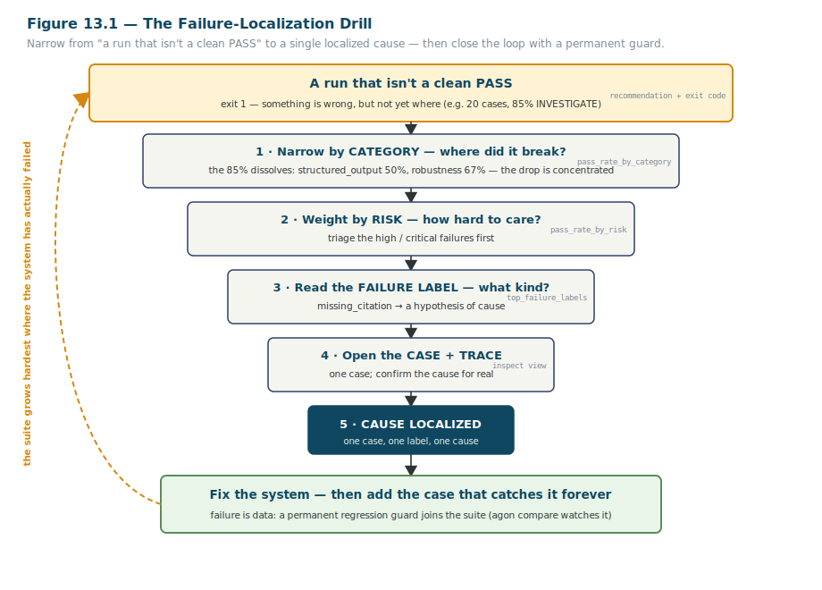

<!--
  STYLING NOTE (for the eventual .docx build — not part of the body text):
  General style guide (Steel Blue / Charcoal / Amber, Segoe UI 11pt body) governs everything here,
  with ONE deliberate override: the full heading hierarchy (H1–H4) is rendered in Teal-Blue #0F4761.
  No AVSH branding, no AVSH running header/footer — this is a Learning artifact about Agon.
  Markdown cannot carry heading color; apply #0F4761 to all heading styles when this is typeset.
  Fig. 13.1 (failure-localization drill) is SVG vector art in ./figures/. Code/output is verbatim
  from offline runs against the repo during drafting.
-->

# The Agon Eval Harness — A Practitioner's Manual
## Part III — Measuring Honestly

| | |
|---|---|
| **Document code** | AGON-TM-001 |
| **Part** | III — Measuring Honestly (Chapters 12–13) |
| **Version** | 0.1 — *draft for review* |
| **Date** | 2026-06-08 |
| **Author** | Samuel R. Taylor |
| **Status** | Draft. Follows Parts I–II. Carries their conventions forward. |

---

### About this part

Part II taught you to run the harness and read its output. Part III is about not fooling yourself with that output. Two chapters, tightly paired. Chapter 12 is about *uncertainty* — a pass rate is an estimate, not a fact, and the harness reports the error bars that say how much to trust it. Chapter 13 is about *localization* — when a result is bad, where exactly did it go wrong, is it even the system's fault, and how do you keep the failure from coming back silently.

These are the two disciplines that separate honest measurement from confident guessing. They map directly onto two of the four goals this manual is organized around: reading a result correctly, and localizing failures so they can be fixed and kept fixed (Goal #4). Chapter 13 carries the third of the manual's required figures and is the deepest chapter so far, because failure localization is where evaluation actually earns its keep.

As before: every command and output shown was run offline against the repository while drafting, and is real. Section tags mark **`[code-resident]`** (in the repo, taught here) versus **`[rationale-only]`** (supplied from outside it). And every results-bearing section ends by telling you what the result is *telling you to do*.

---

# PART III — MEASURING HONESTLY

---

## Chapter 12 — Statistical Honesty: Confidence, Significance & Small Samples

This is the chapter a numerate non-statistician needs and rarely gets. You do not need to have studied statistics to operate the harness honestly — but you do need three ideas, built up carefully: that a pass rate has error bars, that a difference between two runs can be real or just noise, and that a small sample limits what you're allowed to conclude. We'll build each one from the problem it solves, the way Part I promised — sequential construction, not a formula dump.

### A pass rate is an estimate, not a fact

*The harness computes this; the interpretation is taught. `[code-resident]` mechanics, `[rationale-only]` meaning.*

Start with the core idea, because everything else follows from it. When the harness reports "85% passed," that 85% is not a fact about your system. It is an *estimate*, computed from a sample of cases, of some underlying true pass rate you can never observe directly. Run a different twenty cases, or the same cases against a stochastic system a second time, and you'd get a slightly different number — not because the system changed, but because you drew a different sample.

This is exactly the T&E reflex about instrumentation, pointed at the result itself. You would never report a sensor reading without its tolerance; "the pressure is 100 psi ± 3" tells the reader something "the pressure is 100 psi" hides. A pass rate is the same. The honest form of "85%" is "85%, and here is how sure we are of that 85%." The thing that expresses the "how sure" is a **confidence interval**.

### The Wilson interval, and why not the obvious one

*This is `[code-resident]` in `agon/stats/proportion.py` and ADR-0007; taught, not cited.*

You saw the interval in every report in Part II. Here it is again, from the real quickstart run:

```
Overall pass rate | 85.0% [64.0%, 94.8%] (17/20)
```

The bracketed range — `[64.0%, 94.8%]` — is the **95% confidence interval** on the pass rate. The point estimate is 85%, but the interval says the true rate plausibly lies somewhere from about 64% to about 95%, given that we only saw 17 of 20. That width is the honesty: on twenty cases, "85%" is a much softer claim than it looks.

The harness computes this with the **Wilson score interval**, and the choice of *Wilson* over the more obvious method is worth understanding, because it's a small lesson in why the easy formula is sometimes the wrong one. The textbook-first interval — the "normal approximation," or Wald interval — is just `p ± z·√(p(1−p)/n)`. It's simple, and it falls apart exactly where evaluation lives:

- **At the extremes it gives nonsense.** A run that passes 0 of 20 has `p = 0`, so the normal interval is `0 ± 0 = [0, 0]` — it claims *perfect certainty* that the true failure rate is zero, which is absurd on twenty cases. The Wilson interval instead reports `0.0% [0.0%, 16.1%]` (you saw this exact value on the bare-mock run in Chapter 5): zero observed, but the true rate could plausibly be as high as one-in-six. That is the honest reading.
- **At small n it can leave the valid range.** The normal interval can dip below 0% or above 100% — impossible values for a proportion. Wilson is constructed to stay inside `[0, 1]` and to sit *asymmetrically* near the edges, which is exactly right: when you're near 100%, there's more room to be wrong on the low side than the high side.

So Wilson isn't academic fussiness. It's the interval that stays honest at 0%, at 100%, and at the small sample sizes that real eval suites actually run. The harness uses it everywhere a pass rate appears.

### Small samples, and what they forbid

*This is `[code-resident]` — the `small_sample` flag (n < 30).*

You also saw, in every twenty-case report, this note:

```
> Small sample (n=20 < 30): treat pass rates and intervals with caution.
```

The harness flags any run under **30 cases** as a small sample. Thirty is a rule-of-thumb threshold — below it, the normal-approximation machinery underlying these statistics is shakier, and more to the point, *individual cases swing the result hard.* On twenty cases, one case flipping from fail to pass moves the rate five whole percentage points. If you treat a five-point move as a meaningful signal on a twenty-case run, you are not measuring — you are reacting to noise.

The flag's job is to enforce a specific discipline: before you treat *any* movement as real, ask whether your sample is large enough to see it. The decision the small-sample note hands you is "get more cases before drawing a strong conclusion." It is the harness reminding you that a confident number on thin evidence is false precision, which is worse than acknowledged uncertainty because it forecloses the question you should still be asking.

### Is a difference real? The two-proportion test

*This is `[code-resident]` in `agon/stats/proportion.py`.*

Now the second idea. You run your system today and get 85%; you ran it last week and got 90%. Did it regress, or did you just draw an unluckier sample from the same underlying system? You cannot answer that by staring at "90 vs 85." You need a test.

The harness uses a **two-proportion z-test**, which asks precisely that question: given the two pass rates and the two sample sizes, is the difference larger than you'd expect from random sampling variation alone? It reports a **p-value** — the probability of seeing a difference this large purely by chance if the two systems were really identical — and flags the difference as **significant** when that probability drops below 5%.

Here is the real output, from comparing the bare-mock run (0/20) against the quickstart baseline (17/20):

```
overall pass-rate diff: -85.0pp (p=0.000, significant; small sample)
```

Read it in plain language: the pass rate fell 85 percentage points; the chance of a drop that large being mere sampling noise is essentially zero (`p=0.000`); so the difference is **significant** — real, not noise. (The `small sample` tag is still there, honestly, because twenty cases is twenty cases even when the effect is huge.) The decision this hands you: a significant drop is a real change you should act on; a *non*-significant move might be noise you should not overreact to.

### What a confidence interval means — and what it doesn't

*Supplied for a numerate non-statistician; the code computes CIs but never interprets them. `[rationale-only]`*

Two misreadings of a confidence interval are common enough that naming them is worth a section, because acting on the wrong interpretation leads to wrong decisions.

**What the 95% interval `[64%, 94.8%]` means:** if you repeated this whole evaluation many times, drawing a fresh sample each time, about 95% of the intervals you'd compute would contain the true pass rate. The confidence is a property of the *procedure* — it's a statement about how often this method captures the truth over the long run.

**What it does *not* mean:** it is *not* "there's a 95% probability the true rate is between 64% and 94.8%." That sounds almost identical and is a different claim — the true rate is a fixed (if unknown) number; it's either in this particular interval or it isn't. The randomness is in the sampling, not in the truth. This distinction sounds pedantic until you notice it changes your behavior: the right reading keeps you focused on *sample size* (a wider interval means "I need more cases"), while the wrong reading tempts you to treat one interval as a settled probability and stop gathering evidence.

For practical purposes, here's the interval as a decision tool, which is all you really need:

- **Narrow interval** → the estimate is well-pinned; you can act on it.
- **Wide interval** → the estimate is soft; gather more cases before a strong conclusion.
- **Two intervals that barely overlap or don't** → the difference is probably real (and the z-test will usually agree).
- **Two intervals that overlap heavily** → the difference may be noise; don't overreact.

### The deliberate limits — and why they're the right trade

*This is `[code-resident]` in ADR-0007 (Decision + Deferred sections).*

Two design choices about these statistics are worth knowing, because they tell you what the harness is and isn't claiming.

First, all of this is computed **closed-form in pure Python** — no scipy, no numpy. The normal distribution comes from `math.erf` in the standard library; the critical values are constants. The reason is the offline-first commitment from Chapter 5: adding a heavy numerical dependency would compromise the "clone and run in under twenty minutes with nothing external" bar. The statistics are textbook formulas, and textbook formulas don't need a scientific-computing stack.

Second, and more important for how you read results, the harness **deliberately stops** at a modest set of statistics. It does *not* do Bayesian or credible intervals, sequential testing, statistical power analysis, multiple-comparison correction across the per-category tests, or per-case significance on continuous scores. Those are real techniques with real value, and they were consciously deferred. The trade is honest: the harness gives you enough statistical machinery to avoid the two cardinal sins — over-trusting a thin number and over-reacting to noise — without pretending to a rigor it hasn't built. A practitioner who wants a formal power analysis should reach for a statistics tool; the harness's job is to make everyday eval results honest, not to be a statistics package.

### The most important honesty: significance informs, it does not gate

*This is `[code-resident]` in ADR-0007; flagged here as the load-bearing point of the chapter.*

Here is the single most important thing in this chapter, and it connects straight back to the gate philosophy from Chapter 11. The two-proportion test produces a *significance verdict* — but **that verdict does not control the release gate.** The regression gate (Chapter 13) keys on consequential events: a case that used to pass now failing, or a high-risk score dropping. The z-test is reported *alongside* that gate as information, not wired *into* it.

The reason is a deliberate refusal of a tempting mistake. If significance gated the decision, you could silence a real regression by pointing at a small sample: "the drop isn't statistically significant, so we ship." The harness forbids that. A case that flipped from pass to fail is a real, consequential failure whether or not the *overall pass-rate move* clears a significance threshold — and the gate treats it as one. Significance tells you whether the *aggregate movement* is distinguishable from noise; it never gets to overrule a concrete failure the suite actually caught. The statistics make you honest about uncertainty; they are not a loophole for explaining failures away. Hold that thought — it's exactly how the regression gate behaves in the next chapter.

---

## Chapter 13 — Failure Localization & Regression Tracking

This is the chapter the whole manual has been pointing at. Goal #4 — use the harness to localize failures so they can be fixed and kept from silently regressing — lives here, and it is where evaluation stops being measurement and becomes *engineering*. A pass rate tells you something is wrong. This chapter is about finding out *what*, ruling out the possibility that it's your own test rig, fixing it, and guaranteeing it can never come back unseen.

### The digest: the structured view that makes localization possible

*This is `[code-resident]` in `agon/analysis/logs.py` (the `RunDigest`).*

Everything in this chapter is powered by one object the harness builds from a run: the **`RunDigest`**. When the harness reads a finished run's log, it doesn't just compute one pass rate — it builds a structured digest with exactly the cross-sections you need to narrow a failure down:

- **Per-case records** — for every case: did it pass, its composite score, its category, its risk level, its detected failure labels, and whether it *errored* (more on that distinction shortly).
- **Pass rate by category** — the same breakdown you read in Chapter 11, here as queryable data.
- **Pass rate by risk** — low / medium / high / critical.
- **Top failure labels** — the failure *kinds* across the run, ranked by frequency.
- **Error counts by category** — failures of the *test rig*, classified (the next section).

The digest is the antidote to the single-number hiding place, turned from a reporting feature into a localization tool. Each cross-section is a different way to slice the same twenty results, and localization is the art of slicing along the axis that narrows fastest.

### First question: is it the system, or the rig?

*This is `[code-resident]` in `agon/analysis/errors.py` and ADR-0009; the framing is the chapter's first discipline.*

Before you localize a *system* failure, you must rule out a *rig* failure — and this is the step most people skip, to their cost. A case can come back not-passing for two completely different reasons: the system gave a wrong answer (a real failure you should chase), or *something in the harness or infrastructure broke before the system was even fairly tested* (a network blip, a scorer crash, a timeout). Chasing the second kind as if it were the first wastes your afternoon and, worse, corrupts your read of the system.

So the harness classifies every non-clean sample into a **five-category error taxonomy**, and the categories are designed precisely to separate "the system failed" from "the rig had a bad moment":

| Category | What it means | System or rig? |
|---|---|---|
| `sample` | The SUT itself errored or returned a genuine failure | **System** |
| `scorer` | A scorer or judge crashed while grading | Rig |
| `network` | A transport/provider failure (connection, rate-limit, 5xx) | Rig |
| `timeout` | A wall-clock limit was hit before completion | Rig (usually) |
| `resource` | A budget limit was hit (tokens, cost, context) | Rig / config |

The decision this hands you is immediate and saves real time: **if your failures are concentrated in `network`, `scorer`, `timeout`, or `resource`, do not conclude the system regressed.** The infrastructure had a bad moment. Fix the rig — loosen a timeout, retry the flaky provider, fix the scorer — and re-run. This is the same "fix the rig, don't conclude anything about the SUT yet" decision behind exit code `2` in Chapter 1, now made precise: the taxonomy tells you *which* rig problem you have. Only `sample`-class failures — and ordinary below-threshold results — are the system's, and only those are worth localizing as system failures.

(One honest note the harness's own ADR records: because the underlying engine persists only an error *string*, not a typed exception, the `network`-vs-`sample` split is best-effort pattern-matching. Anything unrecognized falls to `sample`. So treat the taxonomy as a strong hint, not a forensic guarantee — but a strong hint that "this looks like infrastructure" is exactly what you need to avoid the wrong investigation.)

### The localization drill

*The step-by-step procedure is not written down in the repo — supplied here, with the figure. `[rationale-only]`*

Once you've confirmed you're looking at a real system failure, the drill is a disciplined narrowing — from "a run that isn't a clean PASS" down to one case, one label, one cause. Figure 13.1 is the whole procedure; we'll walk it.



*Figure 13.1 — The failure-localization drill. Each step narrows the search, powered by a specific field of the digest (shown in monospace at right). The dashed arc is the close-the-loop step: the localized failure becomes a permanent guard, so the suite grows hardest exactly where the system has actually failed.*

Walk it top to bottom; it sharpens Chapter 11's triage into a repeatable procedure:

1. **Start from the gate, having ruled out the rig.** The run exited `1`. You've checked the error taxonomy and confirmed these are `sample`-class / below-threshold failures, not infrastructure. Now you localize.
2. **Narrow by category.** Go to `pass_rate_by_category`. The 85% dissolves into `structured_output` at 50% and `robustness` at 67% — the drop is *concentrated*, and you've cut the search from twenty cases to a handful without opening anything.
3. **Weight by risk.** Cross with `pass_rate_by_risk`. High-risk failures are triaged first; a high-risk `missing_citation` outranks a medium-risk formatting slip for your attention.
4. **Read the failure label.** `top_failure_labels` (and each case's `detected_failure_labels`) names the *kind* of failure — `missing_citation`, `format_failure`. That's a hypothesis of cause before you've read a single response.
5. **Open the case and its trace.** Drop to one case and read the trace (`uv run inspect view --log-dir logs`): the exact response, the exact scoring decision. The label pointed you here; the trace confirms the truth — did it answer well but omit the citation, or miss the substance entirely?
6. **Cause localized.** One case, one label, one confirmed cause. Now you can fix the *right* thing.

The whole drill is the digest's cross-sections used in sequence, each narrowing the next. That's why the digest exists: not to report, but to *localize*.

### Comparing runs: `agon compare` and `--baseline`

*This is `[code-resident]` in `agon/analysis/regression.py` and the CLI.*

Localizing a single bad run is half of Goal #4. The other half is catching the *change*: a case that used to pass and now doesn't. That's regression tracking, and it's one command. Give it a current run and a baseline:

```bash
uv run agon compare <current_run_id> <baseline_run_id>
```

Here is the real output, comparing the bare-mock run against the quickstart baseline:

```
regression detected: True
  new failures:   format_007, rag_001, rag_002, rag_003, ... (17 total)
  fixed failures: none
  overall pass-rate diff: -85.0pp (p=0.000, significant; small sample)
  drop rag_001: 1.00 ->0.00
  drop rag_002: 1.00 ->0.00
  ...
```

The comparison matches cases **by `test_id`** across the two runs (this is why the content-addressed `dataset_version` from Chapter 6 matters — it confirms the two runs tested the *same* cases) and sorts every common case into a bucket:

- **New failures** — passed in the baseline, fail now. These are the regressions proper.
- **Fixed failures** — failed in the baseline, pass now. Progress.
- **Score drops / improvements** — composite score moved by more than a small epsilon (0.05), in either direction.
- **Category regressions** — a whole category's pass rate dropped.

You can also fold the check into a run with `--baseline <run_id>` on `agon run`, so a single command runs the eval *and* gates on regression against a known-good prior run — the Phase 2 "is it still as good as when we shipped?" question from Chapter 4, in one line.

### What counts as a "regression" — consequential, not just statistical

*This is `[code-resident]` in `regression.py`; flagged because it's the subtle, load-bearing rule.*

Now the rule that ties this chapter to Chapter 12, and it's worth stating exactly because it's easy to get wrong. The harness declares `regression detected: True` when **either** of two things is true:

1. **Any new failure** — a case that passed in the baseline now fails, **or**
2. **A high-risk score drop** — any `high`- or `critical`-risk case's score fell by more than the epsilon.

Read what's *not* on that list. A significant move in the *overall pass rate* does not, by itself, trigger a detected regression. A score drop on a *low- or medium-risk* case does not, by itself, trigger one. The gate keys on **consequential** change — a case actually flipping, or a high-stakes case sliding — not on mere statistical movement.

This is Chapter 12's principle made concrete: **significance informs, consequence gates.** The two-proportion test is printed in that same output (`p=0.000, significant`) as *information*, but it is not what set `regression detected` to `True` — the 17 new failures did. The reverse is just as important: a single high-risk case flipping from pass to fail triggers a detected regression even if the overall pass rate barely twitched and the z-test shrugs. The gate cares about the failures that matter, not the aggregate that can hide them. For a T&E reader: this is the difference between a finding that trips an acceptance gate and a measurement that merely drifted within tolerance — and the harness, correctly, gates on the finding.

### Closing the loop: the failure becomes a permanent guard

*This is `[code-resident]` — mandated in CLAUDE.md; taught here as the habit that makes the harness compound.*

The drill ends where the whole discipline began, in Chapter 1: **failure is data.** You've localized a real failure and fixed it. You are not done. The last step — the dashed arc in Figure 13.1, and the thing that distinguishes a harness from a one-time test rig — is to make sure a case exists that will catch this exact failure if it ever returns.

If the failure came from a case already in your suite, you have it: that case is now a standing regression guard, and the next `agon compare` will flag it the instant it flips back. If the failure was discovered some other way — in production, in an ad-hoc check — you write the case now and add it to the suite. Either way, the localized failure becomes permanent institutional memory. It can never silently return, because a case that exists specifically to catch it will go red the moment it does.

This is what makes the suite *compound*. Every failure the system has ever had leaves behind a guard, so the suite grows hardest exactly where the system has historically been weakest — which is exactly where you most need it to be hard. For a T&E reader this is TAAF — test, analyze, and fix — with the "fix" institutionalized: the corrective action isn't just the code change, it's the permanent test that proves the change held and stays vigilant. The arena accumulates opponents. The contest never closes. And the localization drill, run faithfully and closed every time, is the mechanism by which a system gets genuinely, durably better instead of just passing today's run.

---

## End of Part III — what to review

Part III covered the two honesty disciplines: statistical honesty — Wilson intervals, the two-proportion test, the small-sample flag, and the deliberate limits (Ch 12) — and failure localization with regression tracking — the digest, the error taxonomy, the drill, the compare gate, and closing the loop (Ch 13). The required failure-localization figure (13.1) is included in the Part I visual language. Every command and output was run offline against the repo during drafting.

Calibration points I'd value a verdict on:

- **The statistics depth (Ch 12).** This is the second "teach it, don't cite it" chapter for a non-CS reader (after Cohen's kappa in Ch 9). Is the build-up — estimate → Wilson over Wald → small-sample → significance → what a CI does and doesn't mean — the right depth, or should the formulas appear / disappear?
- **The two load-bearing honesty beats.** "Significance informs, consequence gates" appears in both chapters (Ch 12 closes on it, Ch 13's regression rule is its concrete form). Is repeating it across the two chapters the right reinforcement, or redundant?
- **The "is it the system or the rig?" step (Ch 13).** I made the error taxonomy the *first* move of the drill, ahead of category/risk/label, because skipping it is the most expensive mistake. Is that the right prominence, or does it belong later as a sidebar?
- **Figure 13.1.** The drill is drawn as a narrowing funnel with a close-the-loop arc, reusing the Part I palette (amber gate, steel boxes, teal "localized" point, sage fix-and-guard, amber feedback arc). Does the funnel read clearly? This is the third required figure — confirm the style before I draw the fourth (the OpenTelemetry span tree, Ch 19).

On your sign-off, I proceed to Part IV (Specialized Evaluations — retrieval, agents, adversarial, and regulated-domain, Ch 14–17), the four chapters closest to your DoD/T&E world.
