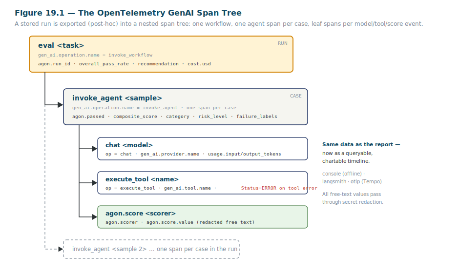

<!--
  STYLING NOTE (for the eventual .docx build — not part of the body text):
  General style guide (Steel Blue / Charcoal / Amber, Segoe UI 11pt body) governs everything here,
  with ONE deliberate override: the full heading hierarchy (H1–H4) is rendered in Teal-Blue #0F4761.
  No AVSH branding, no AVSH running header/footer — this is a Learning artifact about Agon.
  Markdown cannot carry heading color; apply #0F4761 to all heading styles when this is typeset.
  Fig. 19.1 (OpenTelemetry span tree) is SVG vector art in ./figures/. Output is verbatim from
  offline runs against the repo during drafting.
-->

# The Agon Eval Harness — A Practitioner's Manual
## Part V — Production & Scale

| | |
|---|---|
| **Document code** | AGON-TM-001 |
| **Part** | V — Production & Scale (Chapters 18–20) |
| **Version** | 0.1 — *draft for review* |
| **Date** | 2026-06-08 |
| **Author** | Samuel R. Taylor |
| **Status** | Draft. Follows Parts I–IV. Carries their conventions forward. |

---

### About this part

Everything so far ran offline. Part V is about leaving the sandbox safely and operating the harness at production scale and over time. Three chapters. Chapter 18 takes the harness off the mock and points it at a real, paid model provider — which introduces three new concerns the offline path never had: things fail, things cost money, and things require secrets. Chapter 19 is about *seeing* runs over time — exporting them as traces you can chart on a dashboard, which is how the Phase 2 "is it still as good as when we shipped?" question from Chapter 4 actually gets answered day to day. Chapter 20 is about surviving partial failures: re-running only what didn't finish, without throwing away what did.

This is also where the harness's offline-first discipline pays its most interesting dividend. Going to a real provider changes exactly one thing — the system under test — and leaves the entire rest of the harness identical. The chapters are short on new concepts because there are few; they're mostly about the handful of production realities the mock let you ignore.

Every command and output shown was run offline against the repository while drafting, and is real. The convention tags continue: **`[code-resident]`** (in the repo, taught here) versus **`[rationale-only]`** (supplied from outside it). And every results-bearing section ends by telling you what the result is *telling you to do*.

---

# PART V — PRODUCTION & SCALE

---

## Chapter 18 — Running Against Real Providers: Cost, Resilience & Secrets

The offline mock taught you the whole harness for free. Now you point it at a real model — a hosted provider behind an API — to evaluate an actual system. The mechanics are small; the new responsibilities are not. A real provider can fail mid-run, costs real money, and demands a real API key. This chapter is about handling all three without losing the offline-first virtues that made the harness trustworthy in the first place.

### Pointing the harness at a real model

*This is `[code-resident]` in the config and CLI; see `docs/running-real-evals.md`.*

Going live changes one thing: the SUT adapter. Where the offline path used `mockllm`, a real run uses `litellm` (the adapter that speaks to hosted providers) with a model string naming the provider and model. First, install the providers and set a key:

```bash
uv sync --extra providers       # installs the real-provider client libraries
# put your key in a .env file (or your shell): OPENAI_API_KEY=sk-...
```

Then run, naming the model:

```bash
uv run agon run examples/datasets/rag_smoke.yaml --model openai/gpt-4o --fail-on-error 0.1
```

That's the whole change. As you saw in Chapter 7, passing `--model` without an explicit adapter makes the harness infer `litellm` automatically. Everything else — the cases, the scorers, the composite logic, the reports, the gate — is byte-for-byte the same code that ran offline. This is the payoff of the SUT contract from Chapter 7: the harness genuinely does not care whether `final_answer` came from a mock or from GPT-4o, so going to production is a one-flag change, not a re-platforming.

### Resilience: expose Inspect's knobs, don't reinvent them

*This is `[code-resident]` in ADR-0006, `RunConfig.resilience`, and the CLI.*

A real provider introduces failures the mock never had: transient network errors, rate limits, a runaway run that won't finish. The harness handles these — but it's important *how*, because it's a design lesson you've seen before. The harness does **not** ship its own retry engine. The Inspect engine underneath it already provides retries, backoff, timeouts, and concurrency as first-class features (and so does LiteLLM beneath that). So the harness simply **exposes** those knobs and lets the engine execute them — the same build-vs-buy judgment from Chapter 3 (ADR-0001), applied to resilience:

| Flag | Controls |
|---|---|
| `--max-retries` | Per-request retries (default **5** — bounded, so a run can't hang forever on a rate limit) |
| `--request-timeout` | Whole-request timeout (seconds) |
| `--attempt-timeout` | Per-attempt timeout (seconds) |
| `--retry-on-error` | Per-sample retries |
| `--sample-time-limit` | Per-sample wall-clock cap (seconds) |
| `--fail-on-error` | `true`/`false`, or an error-rate threshold in `0..1` |

The `--fail-on-error 0.1` in the command above is the one worth understanding: it says "abort the run if more than 10% of cases error." That's the difference between "one flaky call shouldn't sink a 200-case run" and "if a tenth of the run is erroring, something is wrong — stop and don't trust the result." One bounded default also matters: `max-retries` defaults to 5, where the raw engine's default is *unlimited* — a deliberate hardening choice so a real run fails in bounded time rather than hanging indefinitely on a persistent rate limit. The lesson generalizes: when your foundation already solves a hard problem well, your job is to expose it cleanly and choose sane defaults, not to rebuild it worse.

### Cost: a dated, advisory estimate — not billing truth

*This is `[code-resident]` in `agon/cost/` and ADR-0006.*

A real run costs money, so every report carries a cost figure. You saw it on the offline run reading `$0.0000` — accurate, because the mock is free. On a real run it reads a real estimate. But read the framing carefully, because the harness is deliberate about what this number *is*:

```
| Estimated cost | $0.0000 (as of 2026-06-05) |
```

The cost is computed by taking the token usage the engine actually metered and pricing it against an **in-repo price table stamped with a date** (`as of <date>`). That construction tells you exactly what to trust and what not to:

- It is an **estimate**, derived from a price snapshot baked into the harness, **not** a reading from your provider's billing system. Provider prices change; the table will drift; the date tells you how stale it might be.
- An **unknown model** (one not in the table) degrades gracefully: it's reported as *unpriced* with a note, never as a confidently-wrong number. Honest absence over false precision — the evidence-over-claims rule again.
- **Zero usage is free**, and mock/offline runs price at `$0.0000` because they genuinely cost nothing.

So the decision this figure supports is "roughly, what did this run cost, and is that sustainable to run in CI?" — *not* "reconcile this against my invoice." The ADR's own phrase is the right mental model: **this is observability, not billing.** For a T&E reader, it's an engineering estimate with a stated as-of date, useful for planning and tripwires, never confused with an audited financial figure.

### Secrets: keep the key out of the artifacts

*This is `[code-resident]` in `agon/secrets.py` and ADR-0010.*

A real run needs an API key in your environment — and the moment a harness handles a key, it inherits a responsibility the offline path never had: a leaked key in a committed report or shared trace is a genuine security failure. The whole point of these artifacts is that you *share them as evidence*, which is exactly what makes a leaked secret in one dangerous. The harness addresses this with four offline-first capabilities, and stores no secrets itself:

1. **Redaction at every boundary it writes.** Before any report or trace is written, the harness scans the content and masks secrets — both the *exact values* of known key environment variables and, as a backstop, any text matching recognizable key prefixes (`sk-ant-`, `sk-`, `lsv2_`, …) followed by a high-entropy body. The mask format is `<prefix>...<last4>` — e.g. `sk-ant-...a3f9` — which is unreconstructable from a prefix plus four characters.
2. **Preflight that fails fast.** Before a real (`litellm`) run, the harness checks that the provider's required key is present, and if it's missing, **aborts with exit code 2** and a one-line message naming the exact variable to set — in under a second, instead of failing deep inside a provider call with a cryptic error.
3. **`agon doctor`**, which you met in Chapter 5 — it shows each key's *masked* status, never the raw value.
4. **`.env` loaded at CLI entry**, so preflight and `doctor` see your keys (the engine only loads `.env` later, at eval time, which would be too late for the preflight check).

The decision these hand you: a report or trace that Agon wrote is safe to commit and share. That's a property you can rely on — with one important exception.

### The honest limitation: the raw `.eval` log is not redacted

*This is `[code-resident]` in ADR-0010's "Known limitations" — flagged because it's a real operational gotcha.*

Here is the boundary the harness is explicit about, and you need to know it before you share files. The redaction covers **the artifacts Agon itself serializes** — the Markdown, JSON, and JUnit reports, the OpenTelemetry spans, and `doctor` output. It does **not** cover the raw `.eval` log file, because the *engine* (Inspect) owns that serialization, and it echoes user-supplied config fields verbatim into the log header.

What this means in practice: a provider key sourced from your *environment* does **not** reach the `.eval` log — but a secret you *deliberately put in a config field* (say, jammed into `system_version`) would. And the persisted artifacts that *are* redacted still ship about twelve identifiable characters (the prefix plus last four), which is unreconstructable but not nothing. The operational rule is simple and worth internalizing: **the reports, traces, and doctor output are sanitized and safe to share; treat the raw `.eval` logs the way you'd treat raw provider logs** — as potentially containing whatever you fed in. For a T&E reader handling controlled artifacts, this is the familiar discipline of knowing precisely which outputs are sanitized for release and which are working files that aren't — and never confusing the two.

---

## Chapter 19 — Observability & Tracing

A single report tells you how one run went. Operating a fielded system means watching *many* runs over time — pass rate trending, errors by category accumulating, cost per run drifting. That's observability, and the harness provides it by exporting any stored run as a tree of OpenTelemetry spans you can send to a dashboard. This chapter is where the Phase 2 "maintain trust after deployment" half of the two-phase workflow (Chapter 4) finally gets its tooling.

### Why export after the run, not stream during it

*This is `[code-resident]` in ADR-0003.*

There were two ways to build this, and the choice teaches something about eval harnesses specifically. The harness could have hooked into the engine's run loop and emitted spans *live, as the run happens*. Instead it **exports post-hoc** — it walks the immutable run log *after* the run finishes and builds the span tree from the recorded events. Three reasons this is the better fit:

- **It's deterministic and testable.** A pure "log in, spans out" function can be asserted against an in-memory span exporter, with no live-async context to wrangle. Live hooks fire inside the engine's concurrent loop, where managing parent/child span relationships across callbacks is fiddly and hard to test — and a tracing layer you can't test is a tracing layer you can't trust.
- **It's complete and accurate.** The stored log already carries every model and tool event *with both a start and a completion timestamp*, so the exported spans get real durations and a correctly-nested tree — not approximations stitched together live.
- **It fits how evals are used.** You run an eval, then you look at it. There's no need for live streaming — and the post-hoc design means *any* stored run, including one from months ago, can be exported and charted. You're never locked out of a historical run's trace.

The one tradeoff, named honestly in the ADR: the trace appears *after* the run, not during it. For an eval harness, that's exactly right — and if live streaming is ever needed, a hooks path can be added without disturbing this one.

### The span tree

*This is `[code-resident]` in `agon/observability/exporter.py` and `semconv.py`; the figure is the canonical reference.*

A trace is a tree of nested **spans**, each a timed operation with attributes. The harness maps a run onto a tree that follows the OpenTelemetry **GenAI** semantic conventions — the emerging industry standard for tracing AI systems — so the output is legible to any tool that speaks them. Figure 19.1 is the shape.



*Figure 19.1 — The span tree. The run is one `eval` workflow span; each case is an `invoke_agent` span; each model call, tool call, and scoring decision within a case is a leaf span. Evaluation outcomes (pass/fail, score, category, risk, cost) ride as queryable attributes; all free-text values pass through secret redaction.*

Read it top down:

- **`eval <task>`** — the root, one per run (operation `invoke_workflow`). It carries the run-level headline as attributes: `agon.run_id`, `overall_pass_rate`, `recommendation`, cost in USD and tokens.
- **`invoke_agent <sample>`** — one per case. It carries that case's outcome: `agon.passed`, `composite_score`, `category`, `risk_level`, `failure_labels`.
- The leaves, one per event inside a case:
  - **`chat <model>`** — a model call (operation `chat`), with `gen_ai.provider.name` and token usage.
  - **`execute_tool <name>`** — a tool call, with `gen_ai.tool.name`, and an **ERROR** status set when the tool errored.
  - **`agon.score <scorer>`** — a scoring decision, with the scorer name and its value.

Here's a slice of the real console export, so you see it's genuinely the standard conventions and not a private format:

```json
{
    "name": "chat mockllm/model",
    "attributes": {
        "gen_ai.operation.name": "chat",
        "gen_ai.provider.name": "mockllm",
        "gen_ai.request.model": "mockllm/model"
    }
}
{
    "name": "execute_tool knowledge_base",
    "attributes": { "gen_ai.operation.name": "execute_tool", ... }
}
```

The crucial design point: **this is the same data as the report, restructured as a queryable, chartable timeline.** The report is for reading one run; the span tree is for charting many. And every free-text value in a span passes through the same secret redaction from Chapter 18 — a trace is a shareable artifact, so it's sanitized like one.

### Exporting: `agon trace` and three backends

*This is `[code-resident]` in the CLI and ADR-0003/0011.*

One command exports a stored run, to one of three destinations:

```bash
uv sync --extra otel
uv run agon trace <run_id> --backend console     # offline, no account — prints spans
uv run agon trace <run_id> --backend langsmith   # to LangSmith dashboards
uv run agon trace <run_id> --backend otlp --endpoint <url>   # to Grafana Tempo, etc.
```

The `console` backend is the offline one — it prints the spans to your terminal with no account, which is how the snippet above was produced and how you verify the export works before wiring up anything external. `langsmith` and `otlp` are config-only paths to real dashboards. Like everything in this part, observability is **opt-in**: it needs the `[otel]` extra and an explicit `agon trace`, and it is never on the offline default eval path — CI's offline gate runs with it off.

### Reading dashboards: connecting tracing to production monitoring

*The dashboard recipes are `[code-resident]` (ADR-0011, `docs/langsmith-dashboards.md`); the operational story is `[rationale-only]`.*

Because the outcome attributes ride on the spans as plain scalars, a dashboard can chart them directly — no reverse-engineering from raw events. The documented recipes give you three views:

- **Pass rate over time** — group runs by date, plot `overall_pass_rate`.
- **Errors by category** — chart the `error_count.<category>` attributes (the taxonomy from Chapter 13) to watch infrastructure health separately from system quality.
- **Cost per run** — plot `cost.usd` to catch a run that suddenly got expensive.

Now the part the repo doesn't say out loud, and the reason this chapter exists where it does. **These dashboards are how Phase 2 actually happens.** Chapter 4 framed the production phase as the harness asking "is the fielded system still as good as when we shipped it?" — but a one-time answer isn't monitoring. *Pass-rate-over-time is that question, made continuous and visible.* When the model underneath your fielded system drifts (the stochastic-SUT problem from Part I), the dashboard is where you see the pass rate sag before a user files a complaint. The error-by-category chart is where you tell "the system is degrading" apart from "our provider is having a bad week." The cost chart is where a runaway shows up as a spike.

For a T&E reader, this is in-service monitoring, and pass-rate-over-time is a control chart on a fielded system: a stable line within bounds is the system holding; a downward trend or a point outside the limits is the signal to investigate — using the very localization drill from Chapter 13. The decision a dashboard hands you isn't a single verdict; it's a standing watch. The trace export is what turns a pile of individual runs into that watch.

---

## Chapter 20 — Resume, Recovery & Error Taxonomy

Long runs against real providers don't always finish cleanly — a provider hiccups, a timeout fires, a machine dies halfway through two hundred cases. You don't want to throw away the hundred-and-eighty cases that *did* complete just to recover the twenty that didn't. This short chapter is about `agon resume`: re-running only what failed to complete, and merging it back into one report.

### What resume does, and the distinction that makes it correct

*This is `[code-resident]` in `agon/task/resume.py` and ADR-0009.*

The command is one line:

```bash
uv run agon resume <run_id>        # or: agon resume --latest
```

It reads the prior run's log, finds the cases that didn't finish cleanly, re-runs *only those*, and merges the new results with the prior run's completed ones into a single fresh report. If everything completed, it tells you so and does nothing:

```
nothing to resume: all cases completed in the prior run
```

The subtle, load-bearing decision is in the word "cleanly," and it's the distinction that separates resume from a naïve re-run. A case is treated as *incomplete* — and therefore re-run — only if it **errored, hit a limit, was never scored, or its scorer crashed.** A case that ran fine and legitimately **scored a FAIL is a result, not an incomplete sample — and it is not re-run.** This is exactly right and exactly the discipline a T&E reader will recognize: a valid test that the system failed is *data you keep*, not a test you redo until you like the answer. Resume recovers tests that didn't validly execute; it never re-rolls tests the system genuinely failed. Conflating the two would let you launder a real failure into a pass by re-running it — and the harness refuses to.

### How cases are reconstructed

*This is `[code-resident]` in `resume.py`.*

For resume to re-run a case, it has to rebuild that case from the prior run's log — and it can, because each case was stored as metadata alongside its sample when the run first executed. Resume reads that embedded case definition back out, reconstructs the `AgonCase`, re-runs it, and merges. The merge prefers the re-run's result per case and recomputes all the aggregates (pass rates, breakdowns) from the combined set, so the merged report is indistinguishable from a clean full run — except the cost reflects only the re-run, since that's the only work resume actually performed.

(One design note worth knowing, because it explains why this is harness-native code rather than a one-liner: the engine's own retry mechanism, `eval_retry`, looks up a task by registry name — but Agon's task is an anonymous in-process object with no registry name, so the engine's retry can't reconstruct it. Resume is implemented in the harness precisely to work around that, which is also what lets it run fully offline against the mock or a callable SUT, preserving the reproducibility bar even for recovery.)

### Where resume connects to the error taxonomy

*This is `[code-resident]`; the taxonomy itself is taught in Chapter 13.*

Resume and the five-category error taxonomy from Chapter 13 are two halves of one idea, and seeing them together is the point of grouping them here. The taxonomy *classifies* why a case didn't complete — `network`, `scorer`, `timeout`, `resource`, or a genuine `sample` failure. Resume *acts* on that: the cases it re-runs are precisely the ones the taxonomy flagged as not-validly-completed (errors and limits), while the genuine results — passes and real fails alike — are left untouched. So the workflow is: a long run partially fails, the taxonomy tells you the failures were `network` blips rather than system regressions (Chapter 13's "is it the system or the rig?" question), and `resume` re-runs just those flaky cases to recover a complete, trustworthy run — without a full re-execution and without disturbing the baseline.

### Known limitations

*This is `[code-resident]` in ADR-0009's "Known limitations" — stated because honest scope is the project's rule.*

Three boundaries the harness names about itself, worth knowing before you rely on resume in an edge case:

- **The native ReAct agent path doesn't honor per-case timeouts** — that wiring isn't passed through to the agent task. A limitation, documented, not yet extended.
- **With `epochs > 1`**, the interaction between a per-case time limit firing in a single epoch and the flake reducer's overall verdict is imperfect — per-case timeouts are designed for the common single-epoch path.
- **Resume can't *loosen* a per-case time limit** — a case's own `sample_time_limit` wins over the run-level default, so a case that timed out under its own tight limit will time out again on resume unless you change the case. The run-level default can still be loosened for cases that don't set their own.

Naming these is itself the lesson the whole manual keeps returning to: a harness you can trust is one that's honest about where it stops. Resume recovers the common cases of partial failure cleanly and tells you, in its own decision records, exactly which uncommon ones it doesn't. That honesty — about cost, about secrets, about resume's edges — is not a series of apologies. It's the same evidence-over-claims discipline applied to the harness's account of itself: it reports what it does, and what it doesn't, without overclaiming either.

---

## End of Part V — what to review

Part V covered production operation: real providers with resilience, advisory cost, and secret hygiene (Ch 18); observability via post-hoc span export, with the production-monitoring story (Ch 19); and resume/recovery with its connection to the error taxonomy (Ch 20). The fourth required figure (19.1, the span tree) is included in the Part I visual language. Every command and output was run offline against the repo during drafting.

Calibration points I'd value a verdict on:

- **The "honest limitation" beats.** Part V leans hard on naming boundaries — the un-redacted `.eval` log (Ch 18), post-hoc-not-live tracing (Ch 19), resume's three edge cases (Ch 20). I've framed each as the project's evidence-over-claims discipline applied to itself, rather than as caveats. Is that the right framing, or does it read as too many disclaimers for an operations part?
- **Ch 19's production-monitoring close.** The "pass-rate-over-time *is* Phase 2, made continuous" argument is this part's load-bearing `[rationale-only]` piece — the operational story the repo implements but never narrates. Does it land, or does it need a concrete worked dashboard scenario?
- **Part length.** This is the shortest part so far (three operations chapters, few new concepts). That felt right — production is mostly the offline harness plus three realities — but tell me if Ch 20 in particular reads too thin and wants the error-taxonomy material pulled forward from Ch 13 rather than cross-referenced.
- **Figure 19.1.** The span tree is drawn as a nested file-tree with the run as an amber workflow root, cases as steel agent spans, and the score leaf in sage, plus a ghosted "one per sample." This is the fourth and final *required* figure — confirm the set of four (Ch 3, 4, 13, 19) reads as a coherent visual family before I propose the optional supporting figures.

On your sign-off, I proceed to the final batch — Part VI (Extending & Mastery — plugins/custom scorers, the continuous-improvement loop, the capstone, and operating any harness, Ch 21–24) plus the five appendices, which closes the manuscript.
